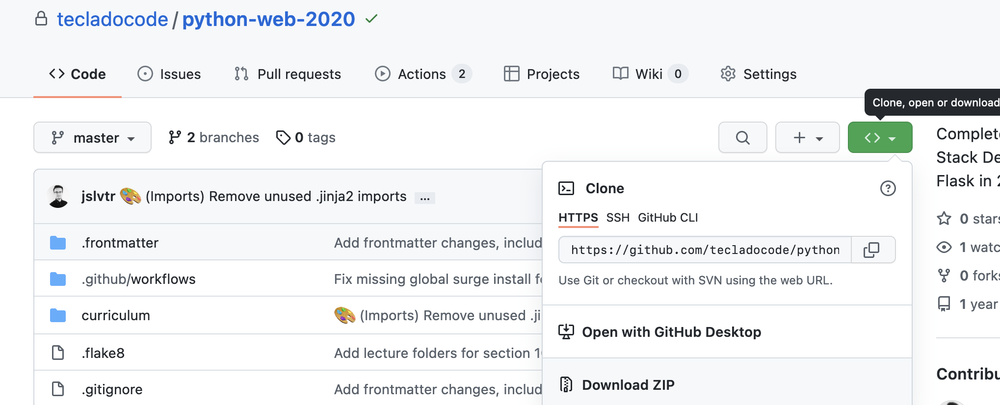

# Web Developer Bootcamp with Flask and Python

 </a>

    

---

💡 A full course to teach you how to use Flask, Python, and MongoDB to make complete, dynamic websites.

📖 Read the e-book <a href="https://python-web.teclado.com">here</a>.

## Getting started

Enrol in the course by going to [this link](https://go.tecla.do/web-dev-course-sale).

Then you can come back here to download the repository, although it is not necessary. Everything you need is available in the e-book (link above).

If you are familiar with Git, you can use Git to download it. Otherwise, you can download it as a zip file:

Next, start taking the course at the beginning! You can use the downloaded code files and [the e-book](https://python-web.teclado.com) to support you while you go through the course.

I also **strongly recommend** you code while you take the course. A good strategy is:

1. Watch the video intently, optionally while taking notes.
2. Watch again, more quickly, while typing the code together with me.
3. Once you're done with the video, play about with the code. Make changes, break things, then fix them, and try to thoroughly understand everything the code does.

If you do this for the entire course, I guarantee you will learn how to make dynamic web apps using Flask and Python well. You'll still be using Google and searching for stuff every day, but so does everyone else!

## Contributing

If you'd like to contribute to this course or e-book, please read the [CONTRIBUTING.md](CONTRIBUTING.md) file to get started!