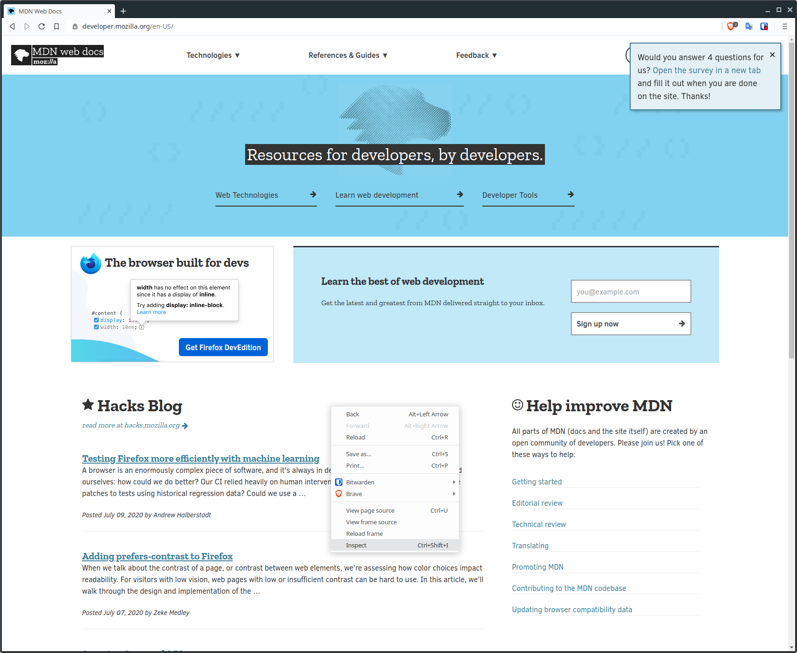
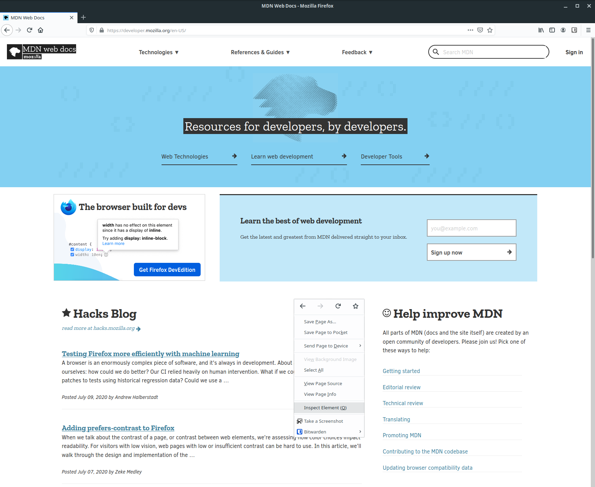
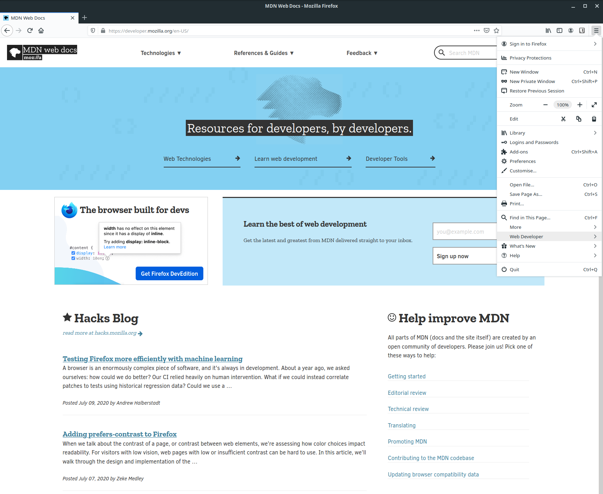
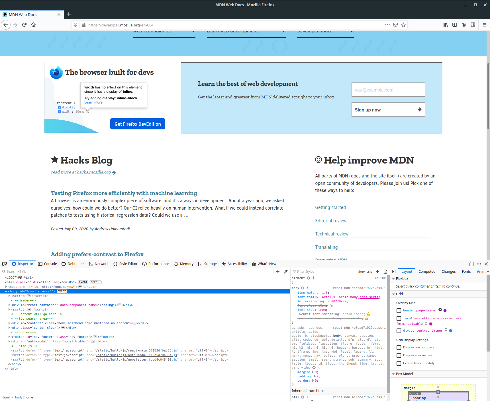
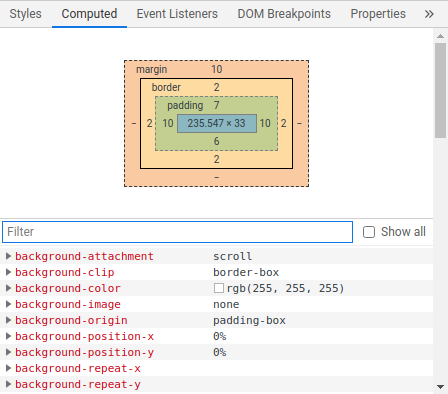

# The Browser Inspector: using the developer tools

When developing web sites and web applications, we use a number of tools to help us during the development process. One of the most important tools in our toolbox is the browser itself, and every major browser includes a suite of development tools that we can use.

These development tools allow us to add and remove elements on the fly, modify styles, and even view detailed performance information for the page.

::: warning Making changes through the developer tools
When using the developer tools, we're not actually modifying any files when we change the page layout or styles. If you make some changes and then refresh the page, the original HTML document will be loaded, which doesn't include any of the changes you've made.

This means that you're free to play around and make any changes you like, but it also means you can easily lose your work once you find something you like.
:::

## Opening the developer tools

In Chrome, Chromium, and Brave you can simply right click somewhere on the page and select "Inspect" from the dropdown menu.

If you prefer to use keyboard shortcuts, you can press either `F12` or `ctrl` + `shift` + `i`.

Regardless of which method you choose, you'll be presented with something like this:

On Firefox, the process is fairly similar. You can right click anywhere on the page and click "Inspect Element".

Alternatively, you can access the developer tools from the main menu. First click the three horizontal lines in the top right corner of the interface, then click the "Web Developer" item in the menu.

This will open another menu where you'll be able to click "Toggle Tools".

The `F12` and `ctrl` + `shift` + `i` shortcuts also work in Firefox.

The developer tools look very similar to those in Chrome:

With that, we're ready to start exploring what the developer tools have to offer!

::: tip Other browsers
The process should be similar in other browsers. If you're not able to find the developer tools for your browser, try Googling the browser name plus "developer tools". You should be able to find a tutorial.

If you're still having trouble, get in touch on our [Discord server](https://discord.gg/BBWwyMq). We'd be happy to help!
:::

## The element browser

The features and layout of different browsers' developer tools are roughly the same, so for the rest of this section we'll focus on Chrome-based browsers, since these are by far the most commonly used.

When you open the developer tools for the first time, you'll be presented with the element browser, which looks like this:

The element browser gives us an interactive representation of the current web page. Every element that makes up the page is listed here, and the hierarchy of elements is preserved.

If we want to inspect an element on the page, we can press the button in the top left of the developer tools, called the _Element Selector_, and then hover over or click on whatever we like in the browser window.

Here I've clicked on the Element Selector and then hovered over an input field for the MDN mailing list sign up form. When I do this, I get this nice tooltip which gives me some information about the element, like its size and background colour. In addition, the element browser has also highlighted the HTML element which I'm currently viewing.

If we look in the element browser, we can see that it's an `<input>` element of type `email`. We can see that it also has a number of other attributes.

This feature is a great way to get hold of a particular element which may be buried deep inside other elements.

:::tip Selecting elements
Note that you can also click on elements directly in the element browser. You don't have to use this selection tool. However, then you won't get the tooltip with information about the element.
:::

## Viewing style information

On the right hand side of the developer tools is another smaller window which looks like this:

This window contains all of the applied style properties for the currently selected element. Don't worry too much about what all of this means right now. We'll be talking about CSS in a lot more detail in the coming sections.

This style viewer is going to be an invaluable tool for when we start writing our own CSS, as we'll be able to spot when certain CSS properties are not being applied as we intended.

For example, if a property has a line through it, it either means the property was overwritten by another style declaration, or that the declaration we made was invalid. In the latter case, we'll see a little warning icon next to the property to indicate this. It makes debugging our CSS a whole lot easier.

:::tip Tip!
This style viewer window can also be a great learning tool. If you see something cool on another site, and you want to know how it was done, you can view the styles for the relevant elements in this window.
:::

## Viewing computed style information

In addition to being able to see the raw property declarations, we can also see the computed values for the different properties. We can view these computed properties by clicking the "Computed" tab.

In CSS we often don't specify exact values for things like the an element's height, or its padding. Instead, we'll use relative units, and these don't really mean anything without some context. We can also choose to inherit properties from a parent element, which means the styles are implicit.

The computed window shows us absolute values for things like sizes, colours, and other properties, so we can see the actual values being used to style a given element. This is another really useful tool for debugging our CSS code.
