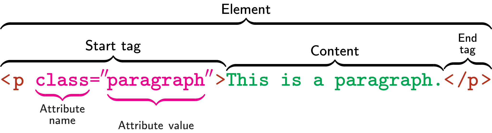

# Elements: The basic components of HTML

In this section we're going to dive into the HTML syntax. Don't worry, HTML is not very complicated, and you'll have a good understanding of what everything means in no time!

## What is an HTML element?

First of all, what is a element in HTML?

An HTML document is composed of units which describe the structure and meaning of a page's content. These components are called HTML *elements*. We write elements using *tags*, which delimit the start and end of a particular element within the document. Content between these "opening" and "closing" tags is considered to be *inside* the element.

::: tip Void elements
Some elements aren't permitted to have content inside them and are called *void elements*. These are written with a single tag in HTML5, rather than an opening an closing tag.

We'll look at some examples thoughout this chapter.
:::

We can place other tags between the start and end tags of other elements, and this is how we construct a hierarchy within the document. We can also place plain text between tags, which is generally how we add text content to a page.

We'll covered nesting HTML elements in more detail [later in this section](../05_nesting_elements/README.md).

## An example HTML element

Let's look an example of a common element: the `<p>` element. `<p>` elements represent paragraphs, but in HTML this means more than breaking up chunks of text.[^p]

Below you'll find a simple example of a `<p>` element with a small amount of text content.

```html
<p>Hello! I'm inside a paragraph element.</p>
```

`<p>` elements have an opening and closing tag, because they're permitted to have content. They wouldn't be much use otherwise!

The opening tag is the name of the element &mdash; `<p>` &mdash; but the closing tag contains a forward slash, which marks it as a closing tag: `</p>`. If we omit this forward slash, it looks like we're trying to create a second paragraph element inside the first.

::: warning Missing closing tags
The HTML parser in our browsers will do its best to fill in missing closing tags when we omit them, but we shouldn't rely on this. It might not put the closing tag where you intended!

Sometimes whole elements will be added if they're missing as well. A good example is the `<html>` element which encapsulates the document's content.
:::

## HTML attributes

In the examples we've seen so far, the opening tag for an element has just been the name of the element, but we can also write attributes in this opening tag as well.

Different HTML elements accept different attributes, and they're used for a wide variety of purposes. For example, we can use an attribute to declare that a form field is required, or we can add anchors that make it easy to refer to a particular element or group of elements.

An attibute is composed of three parts: the attribute name, an assignment operator (`=`), and the value to be associated with this attribute. This value is surrounded by quotation marks.

:::tip Shorthand attributes
In some cases, you may see attributes written as just the attribute name, without the following `=` and value. This is a shorthand for writing `=""` after the attribute name, and it's used for attributes which don't take any value.

An example is the `required` attribute for form fields, which can be written as either `required=""` or, more commonly, as `required`.
:::

Later in this section we'll take a look at some common attributes, `class` and `id`, which can be used as anchors for referring to specific elements.



[^p]: [The usage of `<p>` elements](https://developer.mozilla.org/en-US/docs/Web/HTML/Element/p)
