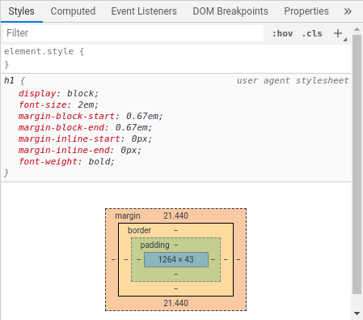
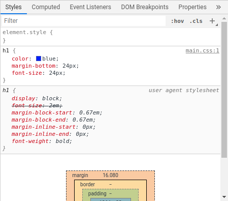

# How to link CSS files with HTML

When we write CSS for a web page, we generally do so inside a dedicated `.css` file. So how do we hook this CSS file up to our HTML document?

We do this using a special HTML element called `<link>` which lives inside the `<head>` of our HTML document.

Let's imagine we have an HTML file like this, called `index.html`:

```html
<!DOCTYPE html>

<html lang="en">

<head>
    <meta charset="UTF-8">
    <meta name="viewport" content="width=device-width, initial-scale=1.0">
    <title>Home</title>
</head>
<body>
    <h1>My Home Page</h1>
    <p>
        Welcome to my home page.
        There's not much here right now, but check back soon!
    </p>
</body>
</html>
```

This contains typical boilerplate HTML code which you'll be including in all of your HTML documents.

:::tip Top tip
Because this is code we have to write all the time, many editors give us useful shortcuts to save us writing this tedious markup out by hand.

For example, in VS Code, you can type `!` followed by `tab` when inside an HTML document to generate a document similar to the one above.
:::

Now let's say we have a css file called `main.css`, which looks like this:

```css
h1 {
    color: blue;
    margin-bottom: 24px;
    font-size: 24px;
}

p {
    color: red;
}
```

Don't worry too much about the syntax for now. We're going to be going into how to write CSS in a lot more detail as we go through this section.

At the moment, none of these styles are being applied to our HTML document, so if we open the document in the browser, we see something like this:


Note that the site isn't completely unstyled. If we go into the developer tools and highlight the `h1` element, we can see a number of default styles being applied by the browser.



Without even knowing any CSS, we can at least see that the font size has been changed somehow, and that the text is being rendered in bold.

Now let's change our HTML code to this:

```html{9}
<!DOCTYPE html>

<html lang="en">

<head>
    <meta charset="UTF-8">
    <meta name="viewport" content="width=device-width, initial-scale=1.0">
    <title>Home</title>
    <link rel="stylesheet" href="main.css">
</head>
<body>
    <h1>My Home Page</h1>
    <p>
        Welcome to my home page.
        There's not much here right now, but check back soon!
    </p>
</body>
</html>
```

This new `<link>` element tells the browser that we want to include an external resource in our document, and the `rel` attribute &mdash; short for "relationship" &mdash; says that this resource is a stylesheet. The `href` attribute provides a path to the resource.

In this case, my `main.css` file is directly next to `index.html`, inside the same folder, so we can just provide the name of the file.


It's not pretty, but our styles are being applied, which means the `<link>` element did its job!

We can get further confirmation by looking at the developer tools once again.



::: tip Other file locations
Often our CSS files won't be in the same folder as our HTML code, as having all our code in a single folder can get really cluttered and hard to navigate. Instead, we often place the CSS files in their own subfolder.

The question is, how do we refer to the files in this case?

If your CSS file is located in a folder called `styles`, you can just write the following:

```html
<link rel="stylesheet" href="styles/main.css">
```
:::

We can see that one of the default styles has been overwritten, and there's now a line through the property. We can also see the new styles we've applied, and we can also see where these styles came from. Note the `main.css:1` on the right. This means the styles came from `main.css` and the definitions for these particular styles start on line `1` of this file.