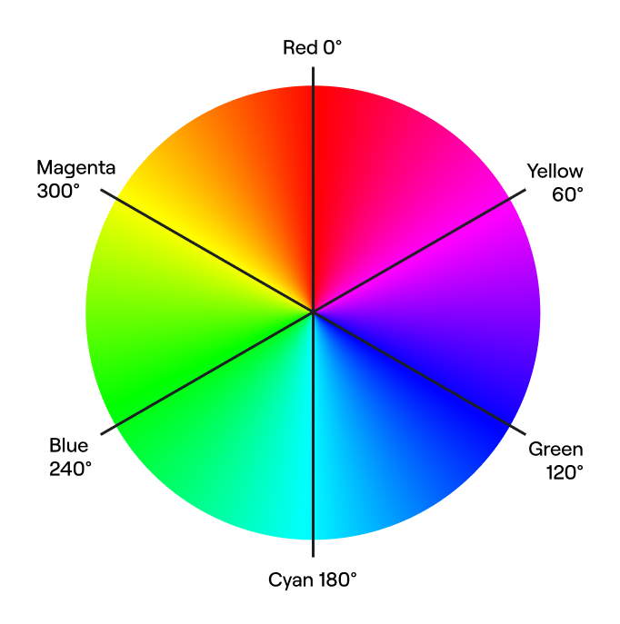

# Representing colour

There are many ways we can represent colours in a computer. You might have heard about RGB, CYMK, and maybe even HSL. Each of these is a different colour model, and they each represent colours in a different way.

In this lecture we'll talk about RGB and HSL in depth, but we won't be covering CYMK, as this is primarily used in printing.

## RGB colours

RGB is an additive colour model, where we add **r**ed, **g**reen, and **b**lue channels in different combinations to produce a wide variety of different colours.

::: tip Why red, green, and blue?
While many of us are taught in school that red, blue, and yellow are the primary colours, this isn't the actually the case.

There are two sets of primary colours: one set for additive mixing, and one for subtractive mixing.

The primary colours for subtractive mixing are cyan, magenta, and yellow. In subtractive mixing, each of the colours blocks out some portion of the light spectrum, and what we see is what's left behind. Subtractive mixing is often used in printing, which is why your printer has cyan, magenta, and yellow ink.

The primary colours for additive mixing are red, blue, and green. In additive mixing, we add light of different wavelengths, and the combination of these different light sources produces a composite colour.
:::

We generally specify these values individually using values between `0` and `255` for 8-bit colour, where a value of `0` for every channel is black, and a value of `255` for each chanel is white.

By combining different colour channels in different combinations, we can produce a wide array of colours and shades.

For example, if we set a value of `128` for the red channel, `0` for the green channel, and `128` for the blue channel, we get a shade of purple. This is actually the purple you get if you used the the named colour, `purple` in CSS.

As we can see from the different channel values, we need a moderate amount of red light, no green light, and a moderate amount of blue light to produce this colour.

::: warning RGB and consistency
RGB colours are not entirely consistent across different devices, or even consistent for the same device over time. You may notice if you open a website on your computer, and then the same site on your phone, that the colours on that site are not quite the same.

One way to combat this is to calibrate devices to a standard colour space like sRGB. If you're doing colour sensitive work, this is something you may need to look into.
:::

### Representing RGB using hexadecimal values

We can represent RGB colours using hexadecimal values, which are much more succinct.

Hexadecimal is a base-16 number system, with the numerals `0-9`, plus `a`, `b`, `c`, `d` , `e`, and `f`. `f` is therefore equivalent to the number `15` in decimal. `ff` is `15` x `15`, which is `255`. 

You can find more information about the hexadecimal number system [here](https://www.electronics-tutorials.ws/binary/bin_3.html).

Hexadecimal values are usually three pairs of two digit values, preceeded by a `#`. In CSS, this `#` is required, so don't forget about it!

To take the example of `purple` again, the hexadecimal equivalent is `#800080`. `128` is `8` lots of `16`, with no remainder, so we get a hexadecimal value of `80` for the red and blue channels, and a value of `00` for the green channel.

## HSL

The HSL colour model is somewhat different to RGB. The initialism stands for **H**ue, **S**aturation, and **L**ightness, and what may be surprising to you is that the first value is an angle.

HSL uses a cylindrical model to represent the available colour space. The angle provded as a value for the hue is essentially a direction on a colour wheel, as though you were looking directly down on the coloured cylinder.

At an angle of `0°` we find the colour red; at `120°` we find the colour green; and at `240°` we find the colour blue.

As we move from the edge of the cylinder to the centre, the colours change from very vibrant to dull. This change is represented by the saturation value.

The higher this value, the more saturated the colour. Low saturation values result in shades of grey. However, the colour we ultimately end up with is dependent on the lightness value.

Lightness indicates the amount of white and black added to the colour.

The maximum lightness value produces the colour white, and the lowest produces black. If the lightness is set to the midpoint between these values, setting a high saturation value will produce the most vibrant version of a given colour.

<small style="display: block; text-align: right;">
    Image created by SharkD,
    <a href="https://creativecommons.org/licenses/by-sa/3.0/">
        CC BY-SA 3.0.
    </a>
</small>

This middle lightness value is sometimes referred to as "normal" lightness.

Now that we have an idea of how these different models work, let's look at how they apply to CSS.
