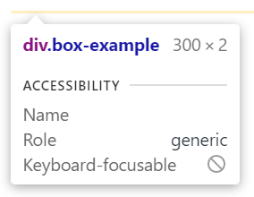

# The CSS Box Model

In this lecture we'll be talking about a *very* important concept in CSS: the *box model*.

## What is the box model?

The box model is essentially how CSS determines the overall size and shape of an element on the page.

The box model is made up of four components: the content area, the box padding, the box borders, and the box margins. These combine together to create the "box" for a given element.

There are actually *two* box models in CSS &mdash; the *standard* box model, and the *alternative* box model &mdash; which combine these components in different ways.

Let's start by looking at the standard box model.

### The standard box model

When working with the standard box model, the `height` and `width` properties for a given element change the size of the content area.

What exactly does this mean?

Let's look at this diagram of the CSS box model below:

<!-- TODO: Change image before this goes into production -->


As we can see, the content area doesn't include the padding for the element, or the borders, or the margins. This is really important to understand, because it means that if you want something to take up `300px` of horizontal space, it's not enough to just set the `width` to `300px`.

Instead, we have to set the `width` to `300px` minus the left and right border width, minus the total horizontal padding.

Let's say our element has a `1px` border on all sides, `10px` of left padding and `20px` of right padding. The code for that might look like this:

```css
.box-example {
    padding-left: 10px;
    padding-right: 20px;
    border: 1px solid #000;
}
```

If we want out element to be `300px` wide, what should the `width` be set to?

```
300px - (2 x 1px) - 10px - 20px
```

The total comes out to `268px`.

```css
.box-example {
    width: 268px;
    padding-left: 10px;
    padding-right: 20px;
    border: 1px solid #000;
}
```

We can go into our developer tools and make sure this all worked correctly. If we hover over the element with the `box-example` class, we should see a little box pop up which looks like this:



The element has `300px` of width, as expected, and `2px` of height, due to the top and bottom border.

The margins are not included in this size calculation, so if you set the `margin` property to, say, `10px`, the developer tools will still show you the same measurements.

### The alternative box model

All of these calculations are really fiddly, and to remedy this, an alternative to the standard box model was introduced.

In the alternative box model, the `height` and `width` properties determine the dimensions of the box to the outside of the border. This means the value we set for the `width` and `height` determine the overall width and height of an element, barring the margins.

We can tell CSS to use the alternative box model for a given element by setting the `box-sizing` property for that element, giving it a value of `border-box`.

I recommend you use `border-box` sizing for *all* of your elements, but unfortunately it's not an inherited property, so we need to be a little clever about how we do this. We don't want to have to manually specify `box-sizing` for every single element on the page, after all!

What we can do instead, is this:

```css
*,
*::before,
*::after {
    box-sizing: inherit;
}

body {
    box-sizing: border-box;
}
```

Here we're using the universal selector to set the `box-sizing` property for every element to `inherit`. We can then set the `box-sizing` property for the `<body>` element. `<body>` is the parent of all of the visual elements on the page, which means the `boder-box` value can be inherited throughout the entire document.

:::tip Why use inherit?
Some of you may be wondering, why not just do something like this:

```css
*,
*::before,
*::after {
    box-sizing: border-box;
}
```

There are two main reasons.

1) Setting an explicit `box-sizing` value means we can't use inheritance later on in cases where we want to switch back to the standard box model.

2) Using `*` to set `box-sizing` to `border-box` universally has a wider reaching effect than inheriting from the `<body>` element. For example, the `<html>` element and everything in the `<head>` would have their `box-sizing` set.
:::

## Block vs inline boxes

The picture we've been painting so far isn't entirely complete, as we've only really discussed the box model for elements being displayed as *blocks*. For inline elements, the story is a little different.

For example, when working with an inline element, we can't set an explicit height and width. The size of the content determines the size of the content box. Any `height` and `width` properties will be ignored.

We also can't create space above and below an element by applying vertical padding and margins. Only horizontal padding and margins will move the content around the element. The same is true of borders.

While vertical padding has no effect on the layout of an inline element in relation to those around it, the padding value is still being applied. This is important to note, as vertical padding will change the position of borders around an inline element. The background will also stretch to fill the space specified by the vertical padding.

## Beyond sizing

It's worth spending the time to get familiar with the components of the box model, even if you plan to always set the `box-sizing` to `border-box`, as these components are used to determine the effect of other properties.

For example, the `background-origin` property allows us to determine where the background ends. We can set values like `border-box`, `padding-box`, and `content-box`, which directly map onto the components of the box model we saw before.

You can find more information on the `background-origin` property [here](https://developer.mozilla.org/en-US/docs/Web/CSS/background-origin).
