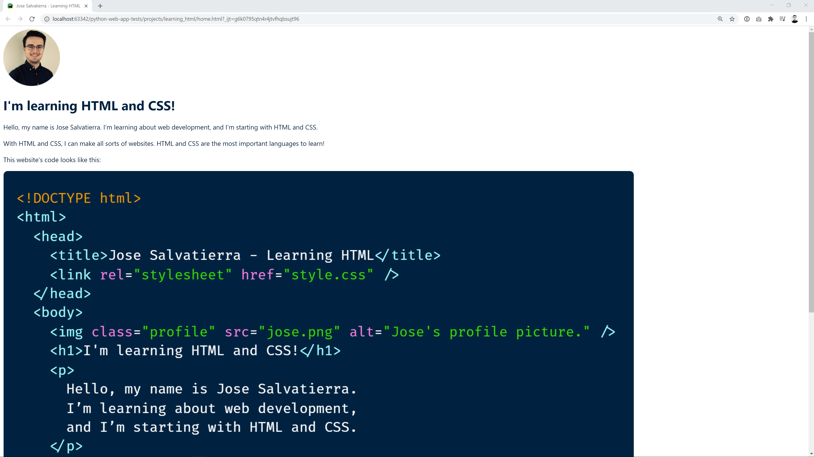
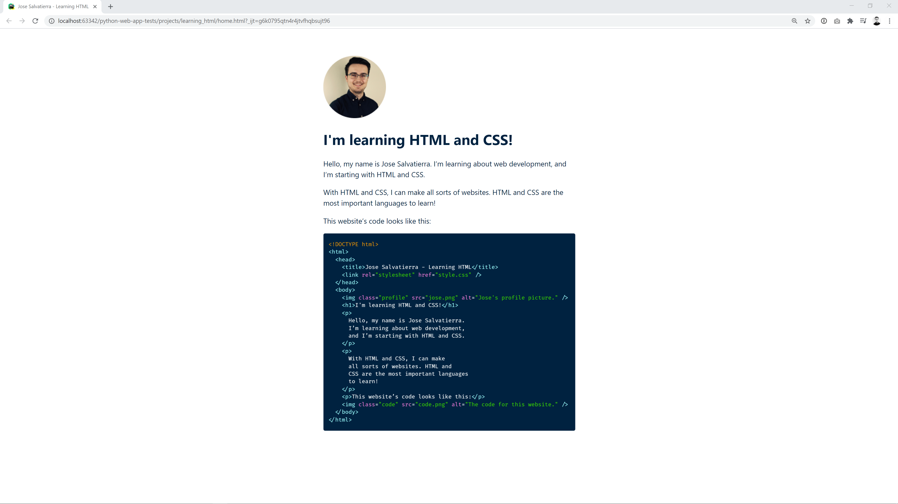

# Working with spacing in our project

In this lecture, let's continue working on our "Learning HTML" project.

As we've just discussed, one of the things we'll almost always do on any site is set the `box-sizing` property. This just helps us think about the size of elements in a more natural way.

In the body, I'll set `box-sizing: border-box;`, and in every other element, I'll set it to `inherit`:

```css
*,
*::before,
*::after {
  box-sizing: inherit;
}

body {
  box-sizing: border-box;
  font-family: -apple-system, BlinkMacSystemFont, "Segoe UI", Ubuntu, sans-serif;
  color: #002240;
}
```

Although this won't make a different in our site at the moment, later on it might!

## Centering the content

One of the most frequent changes in any website involves limiting the size of the main content and centering it horizontally on the page.

We want to limit the size of the content so that lines of text don't become too long. The human eye finds lines around 50-60 characters long easiest to read, so we want to stay around that size.

So instead of this:



We'll get this:


We can do this by creating a `main` element and putting everything inside it. Then, we can give it maximum width and set its left and right margins to be as large as possible.

::: warning
Note that the image is still way to big on both screenshots. We'll be getting to that in a minute!
:::

If we do this, the content will be centered. This is the new HTML code:

```html
<!DOCTYPE html>
<html lang="en">
    <head>
        <meta charset="UTF-8">
        <meta name="viewport"
              content="width=device-width, user-scalable=no, initial-scale=1.0, maximum-scale=1.0, minimum-scale=1.0">
        <title>Jose Salvatierra - Learning HTML</title>
        <link rel="stylesheet" href="style.css" />
    </head>
    <body>
      <main>
          
          <h1>I'm learning HTML and CSS!</h1>
          <p>Hello, my name is Jose Salvatierra. I’m learning about web development, and I’m starting with HTML and CSS.</p>
          <p>With HTML and CSS, I can make all sorts of websites. HTML and CSS are the most important languages to learn!</p>
          <p>This website’s code looks like this:</p>
          
        </main>
    </body>
</html>
```

And this is the CSS code we need to add:

```css
main {
  max-width: 35rem;
  margin: 3.75rem auto 0 auto;
}
```

::: tip
Remember that `35rem` is equal to `35*16px`, since `16px` is the root font size of the page.
:::

With this done, we can go ahead and make sure that our images don't overflow the main content size. If we set a `max-width` on image elements, they won't go over it. Also, they'll keep their proportions (so images won't be squished and deformed):

```css
img {
  max-width: 100%;
}
```

Here I've set the `max-width` to `100%`, which always means 100% of the parent's size. In this case we're referring to width, so this talks about 100% of the parent's width.

Therefore, images won't take up more than the width of the parent. 

Our site now looks like this:



## Adding spacing under headings

We can add a final improvement: a bit more space under the heading. Giving headings room to breathe makes them easier to read and distinguish from the rest of the content.

In order to do this, I'll add a `margin-bottom` on the `h1` elements:

```css
h1 {
  margin-bottom: 2.5rem;
}
```

## Conclusion

That's about it! Our final CSS code for this project looks like this:

```css
*,
*::before,
*::after {
  box-sizing: inherit;
}

body {
  box-sizing: border-box;
  font-family: -apple-system, BlinkMacSystemFont, "Segoe UI", Ubuntu, sans-serif;
  color: #002240;
}

main {
  max-width: 35rem;
  margin: 3.75rem auto 0 auto;
}

h1 {
  margin-bottom: 2.5rem;
}

p {
  line-height: 150%;
}

img {
  max-width: 100%;
}
```

Have a play around with it, and change some properties! Also, take a look at the HTML page without any CSS, and notice what a massive difference just a few lines of CSS can make!