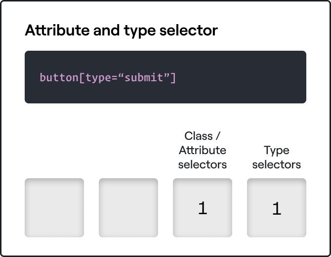
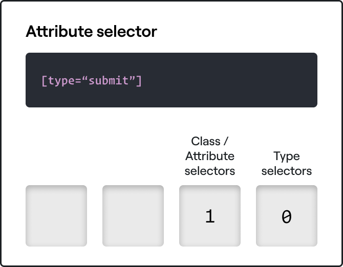
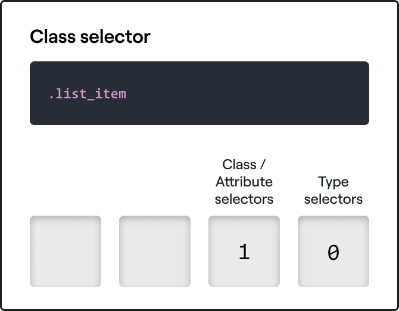
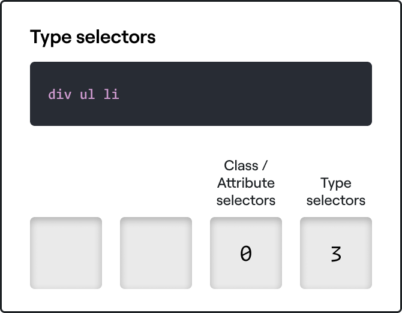
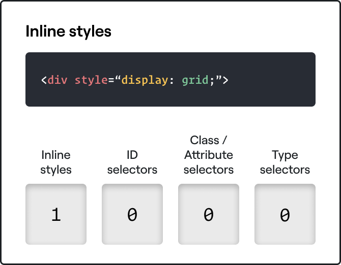
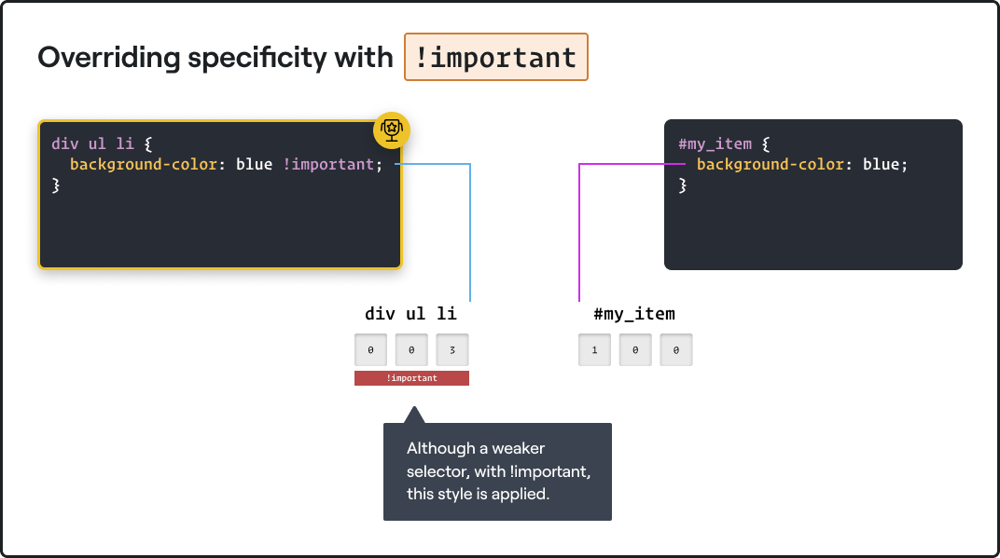

# Specificity in CSS

<!-- TODO: Replace the diagrams in this lecture with something more professional -->

Specificity is a really important concept to understand in CSS, as it's the mechanism used by the browser to determine which CSS propety declarations get applied to a given element.

In practice, specificity is a multi-leveled weighting system which is determined by the selectors we use to apply a given property. The property with the highest weight wins. When there's a tie, the order of the property definitions is what breaks the tie, with subsequent definitions in the code replacing those that came before.

## The Weighting System

Different types of selector contribute to the overall specificity score in different ways.

We can think of there being four categories of selector, with each category having a different weight. A selector of a higher weight beats any number of selectors from a lower weight category. We'll return to this idea in a moment.

### Type selectors

The lowest level of selector which has an effect on specificity is the *type selector*. This is when we write things like `h1` or `p` to select elements of a given type.

In cases where we use combinators, such as the descendent combinator, we need to tally up all of the type selectors used in this compound selector. This will give us a total for this component of the specificity score for an element.

For example, if we look at the following selector, we can see that there are three such elements:

```css
div ul li {
    color: orangered;
}
```


::: tip Pseudo-elements
Pseudo-elements such as `::before` and `::after` count as type selectors for the purposes of calculating specificity. 
:::

### Class and attribute selectors

Class and attribute selectors occupy the next highest category of selector, and therefore have a higher weight than type selectors when it comes to calculating specificity.

We've seen lots of class selectors so far in the course, but not attribute selectors. Attribute selectors let us select elements which have some attribute value, and they look like this:

```css
button[type="submit"] {
    border: 2px solid cyan;
}
```

Here we're selecting `<button>` elements which have their `type` attribute set to `"submit"`. These aren't terribly common selectors, largely because many people don't know they exist, but they can be very powerful in certain situations.

We can use them with or without other selectors, so this is also perfectly valid:

```css
[type="submit"] {
    border: 2px solid cyan;
}
```

The specificty of these two selectors is different, however.

The first has one attribute selector and one type selector:



The second has one attribute selector, but no type selectors:



`button[type="submit"]` therefore has a higher specificity than `[type="submit"]`, and any property declarations we define using that selector will beat those defined under `[type="submit"]` alone.

Note, however, that a single class or attribute selector will beat out any number of type selectors. Take the following HTML code, for example:

```html
<div>
    <ul>
        <li class="list_item"></li>
        <li class="list_item"></li>
        <li class="list_item"></li>
        <li class="list_item"></li>
        <li class="list_item"></li>
    </ul>
</div>
```

Let's say we want to access the `<li>` elements and change the font weight of these elements to `600`: a sort of semi-bold value.

```css
.list_item {
    font-weight: 600;
}

div ul li {
    font-weight: 400;
}
```

Despite there being three type selectors for the second block, and the fact this this block comes later in the code, the `.list_item` selector is the winner, becuase it's a more specific selector.

The table for `.list_item` looks like this:



While the table for `div ul li` looks like this:



Since selectors belonging to a higher weight category beat out any number of selectors from a lower category, having a single class selector is worth more than 50 type selectors. `.list_item` is therefore more specific than `div ul li`, and the font weight of `600` is applied to our `<li>` elements.

:::tip Pseudo-classes
Pseudo-classes such as `:hover` are considered classes for the purposes of specificity.

There are a few exceptions to this rule such as `:not` and the new `:is` pseudo-class. If you're interested, you can read about `:is` [here](https://developer.mozilla.org/en-US/docs/Web/CSS/:is).
:::

### Id selectors

Id selectors are considered yet more specific than classes and attribute selectors and occupy a higher specificity category. This makes some sense, since ids are supposed to be unique, so if we use an id selector, we're very specifically targeting one particular element.

In cases where we have two competing id selectors, the class and attributes selectors are considered next, followed by the type selectors. This means that a selector involving an id **and** a class are considered more specific than those with just an id.

```css
#main {
    display: flex;
}
```

Here the specificity is as follows:


```css
#main.main{
    display: grid;
}
```

While here the specificity is:


### Inline styles

Inline styles have the highest specifity and occupy the final category. Inline styles will overwrite properties defined using any number of id selectors.

```html
<div style="display: grid;">
    ...
</div>
```



::: warning Using inline styles
Using inline styles is generally a bad idea for a couple of reasons:

1) The specificity of inline styles is so high that it's very hard to overwrite them. It can introduce further creeping bad practices when you start wrestling with the high specificity.

2) The styles we apply to a single element are not reusable, which means we often end up writing more code, which has the knock on effect of increasing the maintenance burden.
:::

## `!important`

Writing `!important` as part of a property declaration allows us to override the effect of specificity, making sure that a given property value is applied.

For example, in the code below, the `<p>` text would end up `green`, even though we've used a far more specific selector to set the text colour to `black`:

```css
#main.main .blog p {
    color: black;
}

p {
    color: green !important;
}
```



::: warning A note on bad practice
While it's important to know about `!important`, it's a very commonly abused tool, and generally has no place in your CSS code. It can lead to situations where you're not able to overwrite a given property value, and like inline styles, it can be a gateway for further bad practices to creep in.

It's often used as a crutch by developers who don't understand how specificity works, so make sure you learn the concepts of this lecture well, and don't fall into this common trap.

You can find some guidance on when and how to use `!important` [here](https://developer.mozilla.org/en-US/docs/Web/CSS/Specificity#The_!important_exception).
:::

### Competing `!important` declarations

When two or more competing styles both make use of `!important`, how does the browser decide which property to use?

It actually falls back on specificity. This is where many people get stuck with `!important`, and why it's so vital to learn the concept of specificity well.


Let's imagine somebody is working on their site, and they can't get a property to work because of specificity reasons, so they add `!important` to get the style to apply. It works, so as far as they're concerned, they've done a good job.

Now when they want to overwrite this property elsewhere, they might apply `!important` again, only to find that the style still isn't being applied because the specificity of the original `!important` declaration is higher.

So remember:

- If no declarations use `!important`, the most specific selector wins.
- If there are conflicting property declarations for a given element, and one uses `!important`, then that declaration wins, regardless of specificity.
- If two competing declarations use `!important`, the most specific selector wins.

## The Universal Selector (`*`)

One selector which we haven't mentioned is `*`: the universal selector.

`*` actually has no impact on specificity, so we can think of it as having a specificity lower even than type selectors. Styles defined unde the `*` selector will only be applied if there are no competing definitions for the same property.
