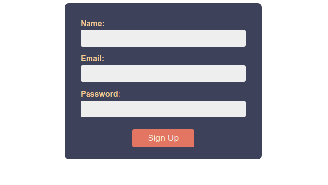

# A Better Approach to CSS Selectors

In this section I want to present an approach to writing CSS selectors which you'll find in lots of production code. As part of this, we're going to talk about a naming scheme called BEM, which will provide a natural way to group our styles, while keeping specificity low throughout out stylesheets.

## What is BEM?

You can think of BEM as both a CSS methodology and a naming scheme. BEM compliant CSS makes almost exclusive use of classes, with most selectors being formed of only a single class. This is to keep specificity uniform across the stylesheet, which makes it easy to overwrite styles by paying attention to the order of the code.

The name BEM stands for **B**lock **E**lement **M**odifier. These three components provide a structure for our style definitions, and determine the names of our classes.

Let's start by taking a look at what each of these components represents so that we can better understand the BEM methodology.

### Blocks

A *block* in BEM is a meaningful, standalone entity. Some examples might be a header bar, a menu, or a form.

Block classes are generally single words which describe the role of a given element, but we can use several words linked by hyphens where more than one word is required.

Here are some example block classes:https://css-tricks.com/snippets/css/a-guide-to-flexbox/

```css
.header {
    padding: 1rem 2rem;
}

.menu {
    list-style: none;
}

.form {
    cursor: pointer;
    display: flex;
    flex-direction: column;
}
```

### Elements

An *element* is a part of a block where the meaning of this component is tied to the block. An item in our menu might be a good example.

Elements classes are written using the following format: `block__element`. The block name comes first, then a pair of underscores, and finally the a descriptive name for the element.

An item in our menu might use the `menu__item` class, for example.

This structure is useful for a couple of reasons.

First, it shows very clearly how a given element fits into the overall structure of our stylesheet. This is not some generic standalone item we're describing: it's an item specific to the `menu`. This gives us a lot of context, and it helps to keep our code organised.

The other reason this structure is handy is that we only need to use a single class for these child elements. They also don't even need to be nested within the HTML document. This is far preferable to using combinators to construct more complex selectors, as that introduces issues with specificity. By using a single class, we can easily overwrite the styles with a single class.

### Modifiers

This brings us nicely to modifiers. Modifiers represent some variant on the basic styles for a block or element.

The modifier component of a class name takes the form of two hyphens followed by the modifier name. This gives us two possible naming schemes: `block__element--modifier` or `block--modifier`.

Let's say we want to highlight the currently selected menu item in our document by changing the background. To do this we'd create a modifier class which we apply only to the element we want to modify. This is used in conjunction with the unmodified class, so we'd have an `<li>` element like this:

```html
<li class="menu__item menu__item--selected">...</li>
```

Our stylesheet might then contain declarations like these:

```css
.menu {
    list-style: none;
}

.menu__item {
    display: block;
    padding: .25rem 0;
}

.menu__item--selected {
    background-color: #89CFF0;
}
```

Modifiers are a vital tool for creating reusable styles, as we can create many variations on some core component throughout our site as necessary.

## BEM in Action

Let's take a look at an example to really lock in the concepts. Here is the HTML we'll be working with:

```html
<!DOCTYPE html>
<html lang="en">

<head>
    <meta charset="UTF-8">
    <meta name="viewport" content="width=device-width, initial-scale=1.0">
    <title>BEM Example</title>
    <link rel="stylesheet" href="style.css">
</head>

<body>
    <form method="POST">
        <p>
            <label for="name">Name:</label>
            <input type="text" name="name" id="name">
        </p>
        <p>
            <label for="email">Email:</label>
            <input type="email" name="email" id="email">
        </p>
        <p>
            <label for="password">Password:</label>
            <input type="password" name="password" id="password">
        </p>

        <button type="submit">Sign Up</button>
    </form>
</body>

</html>
```

Nothing we haven't seen before at this stage. We have our HTML boilerplate; we've linked a stylesheet; and the only visible content for the page is this form.

### Planning our approach

First of all, let's think about the components of this document, so we can figure out what our class structure is going to look like. Let's start with the `<form>` element, since this wraps all of the visible elements in our document.

Clearly the form as a whole represents a block level element in BEM terms, as its a self-contained unit which means something on its own. Conversely, these `<p>` elements represent form groups &mdash; collections of labels and input fields &mdash; and they only make sense in the context of the form. As such, these should probably be elements.

Some of the other elements are not so cut and dry. The `<input>` elements are likely block level elements, because they can be used outside of the context of a form like the one we're building here. We may have an identically styled `<input>` element in the header bar to faciliate quick logins, for example. On the other hand, maybe the `<input>` elements elsewhere in the site are styled completely differently, so there's no reason to share styles. You have to make a judgement in some of these cases.

In this case, let's say that we do want to reuse the `<input>` element styles outside of the form, but the `<label>` elements are specific to the kind of form we're styling here. Those are therefore elements of the form block.

The `<button>` element, like the `<input>` element should be a block, because buttons make sense even if we remove them from the form. Buttons are also likely to feature all over our site, and will probably be styled similarly, so making them block level elements allows us to reuse styles more easily.

Now let's add come up with some class names and add these classes to the HTML elements in our document.

### Adding our classes

Let's start with our BEM blocks. We have three blocks that we've identified so far: one for the form, one for the input elements, and one for the button.

Our names for these blocks need not be complicated. We can go with `form`, `input`, and `button` in this case. Let's add these classes to the document.

```html
<!DOCTYPE html>
<html lang="en">

<head>
    <meta charset="UTF-8">
    <meta name="viewport" content="width=device-width, initial-scale=1.0">
    <title>BEM Example</title>
    <link rel="stylesheet" href="style.css">
</head>

<body>
    <form class="form" method="POST">
        <p>
            <label for="name">Name:</label>
            <input class="input" type="text" name="name" id="name">
        </p>
        <p>
            <label for="email">Email:</label>
            <input class="input" type="email" name="email" id="email">
        </p>
        <p>
            <label for="password">Password:</label>
            <input class="input" type="password" name="password" id="password">
        </p>

        <button class="button" type="submit">Sign Up</button>
    </form>
</body>

</html>
```

Now the elements. We have two elements for this document, both of which are tied to the form block: labels and input groups.

I think `form__label` and `form__group` adequately describe what these components are. Feel free to choose different names if you prefer.

We don't have any modifier classes at this stage, so we can just add our element classes and get to writing style definitions.

```html
<!DOCTYPE html>
<html lang="en">

<head>
    <meta charset="UTF-8">
    <meta name="viewport" content="width=device-width, initial-scale=1.0">
    <title>BEM Example</title>
    <link rel="stylesheet" href="style.css">
</head>

<body>
    <form class="form" method="POST">
        <p class="form__group">
            <label class="form__label" for="name">Name:</label>
            <input class="input" type="text" name="name" id="name">
        </p>
        <p class="form__group">
            <label class="form__label" for="email">Email:</label>
            <input class="input" type="email" name="email" id="email">
        </p>
        <p class="form__group">
            <label class="form__label" for="password">Password:</label>
            <input class="input" type="password" name="password" id="password">
        </p>

        <button class="button" type="submit">Sign Up</button>
    </form>
</body>

</html>
```

### Writing the CSS

Our eventual goal is a form which looks something like this:



Our fist step should always be to set `box-sizing` to `border-box` for all elements.

As we discussed previously, we should do this by using the universal selector to set the `box-sizing` property of all elements to `inherit`. We can then set the `box-sizing` property of the `<body>` element to `box-sizing`. This value will then be inherited by all children of the `<body>` element, which amounts to all visibile elements in the document.

While we're doing this, we should also set a global font size and font type.

```css
*,
*::before,
*::after {
    box-sizing: inherit;
}

html {
    font-size: 18px;
}

body {
    box-sizing: border-box;
    font-family: sans-serif;
}
```

:::tip Setting the global font size
Note that we're setting the font size on the `<html>` element, not the `<body>`. By setting the font size on the `<html>` element, we're changing the *root font size*, which is determines the size of `1rem`.
:::

Now we can get to writing the styles for the form specifically. Let's start with the form container itself.

If we look at the completed version we can see that the form has a background, there is a small amount of rounding to the corners, and the size of the form is restricted in some way. We can see this because it doesn't fill the window, and it's centered in the available space.

Here are styles which I applied to our `form` class to achieve this effect.

```css
.form {
    width: 25rem;
    margin: 0 auto;
    background: #3d405b;
    border-radius: 8px;
}
```

There are two other styles we're going to add to those above. We're going to add some padding inside the form, as it's much more efficient and reliable than adding this spacing to the outside of every element inside the form. We're also going to change the font colour, since the `color` property will be inherited by many elements inside our form.

It's often best to set the `color` on container elements, rather than setting the colour individually on the children. It usually saves us writing unnecessary and repetitive colour definitions.

```css
.form {
    width: 25rem;
    margin: 0 auto;
    padding: 1rem 2rem;
    color: #f2cc8f;
    background: #3d405b;
    border-radius: 8px;
}
```

With that, our `form` block is done! Now let's tackle the form elements.

We can see that the `<label>` elements sit above the `<input>` elements in each form group. We can accomplish this by setting the `display` property of our `form__group` elements to `flex`, and then setting the `flex-direction` to `column`.

```css
.form__group {
    display: flex;
    flex-direction: column;
}
```

This tells the browser that we want the child elements of each `form__group` to sit on top of one another. If you're interested in learning more about flex, there's a great guide on [css-tricks.com](https://css-tricks.com/snippets/css/a-guide-to-flexbox/). It's a really powerful tool that you'll be using all the time.

<!-- TODO: link to our section on flex box when we add it, as well as CSS Tricks -->

That's it for the `form__group` class, so let's look at the `form__label`.

We don't have to do anything crazy here: we just want to add a small amount of margin to the bottom, so that the label and input field aren't so cramped. We also want to bump the font weight up to 600, which is semi-bold.

Now our CSS styles look something like this:

```css
*,
*::before,
*::after {
    box-sizing: inherit;
}

html {
    font-size: 18px;
}

body {
    box-sizing: border-box;
    font-family: sans-serif;
}

.form {
    width: 25rem;
    margin: 0 auto;
    padding: 1rem 2rem;
    color: #f2cc8f;
    background: #3d405b;
    border-radius: 8px;
}

.form__group {
    display: flex;
    flex-direction: column;
}

.form__label {
    margin-bottom: .25rem;
    font-weight: 600;
}
```

Next, let's handle the `input` blocks.

We have a few things we need to do here. We need to change the background colour, remove the border, add some rounding to the box corners, and add some internal padding. We also need to inherit the font size from the `<body>` element, as `<input>` fields won't do this by default, as they already have a defined font size.

```css
.input {
    font-size: inherit;
    padding: .5rem .75rem;
    background: #eee;
    border: none;
    border-radius: 4px;
}
```

::: tip Uneven padding
Note that I've added more padding to the left and right sides than to the top and bottom of the box.

This is really common for buttons and input fields, and you'll start to notice it everywhere now that you know about this pattern.
:::

Finally, let's take care of the `button` block. The `button` is by far the most complex of the units we're styling here, but we can break it down into manageable chunks.

Let's start with the obvious stuff. We can see that the button has a different background and text colour to the rest of the form. The button also currently has a border, but this is missing from the final version, and the corners of the box are slightly rounded. Finally, the font size is slightly larger than the rest of the form.

We can make these changes with the following property definitions:

```css
.button {
    font-size: 1.1rem;
    color: #f4f1de;
    background: #e07a5f;
    border: none;
    border-radius: 4px;
}
```

Now we need to add some internal padding, and we need to position the button correctly within the form. We can see that it's centered, so we need the left and right `margin` properties to have a value of `auto`. To make this work, we need to set the `display` property of the button to `block`.

```css
.button {
    display: block;
    margin: 1.5rem auto .5rem auto;
    padding: .5rem 2rem;
    font-size: 1.1rem;
    color: #f4f1de;
    background: #e07a5f;
    border: none;
    border-radius: 4px;
}
```

It looks done, but we need to make a couple of final changes. To make sure user's know the button is clickable, I want to make sure the user's cursor shows up as a pointer. I also want to change the background colour when the user hovers over the button to make it even clearer that this is an interactive element.

```css
.button {
    display: block;
    margin: 1.5rem auto .5rem auto;
    padding: .5rem 2rem;
    font-size: 1.1rem;
    color: #f4f1de;
    background: #e07a5f;
    border: none;
    border-radius: 4px;
    cursor: pointer;
}

.button:hover {
    background: #ec8164;
}
```

With that, we're done!

## Final Styles

Below you'll find the complete stylesheet. Play around with the values and try to make the design your own.

We'd love to see what you come up with!

```css
*,
*::before,
*::after {
    box-sizing: inherit;
}

html {
    font-size: 18px;
}

body {
    box-sizing: border-box;
    font-family: sans-serif;
}

.button {
    display: block;
    margin: 1.5rem auto .5rem auto;
    padding: .5rem 2rem;
    font-size: 1.1rem;
    color: #f4f1de;
    background: #e07a5f;
    border: none;
    border-radius: 4px;
    cursor: pointer;
}

.button:hover {
    background: #ec8164;
}

.form {
    width: 25rem;
    margin: 0 auto;
    padding: 1rem 2rem;
    color: #f2cc8f;
    background: #3d405b;
    border-radius: 8px;
}

.form__group {
    display: flex;
    flex-direction: column;
}

.form__label {
    margin-bottom: .25rem;
    font-weight: 600;
}

.input {
    font-size: inherit;
    padding: .5rem .75rem;
    background: #eee;
    border: none;
    border-radius: 4px;
}
```
