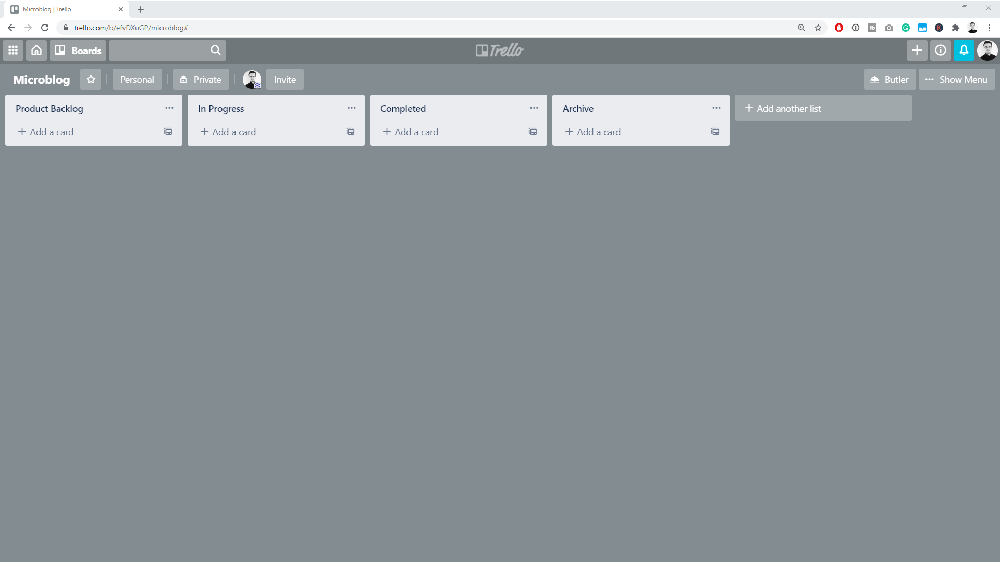
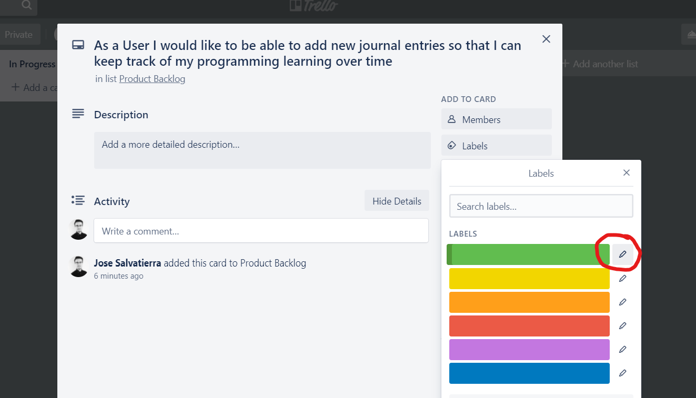
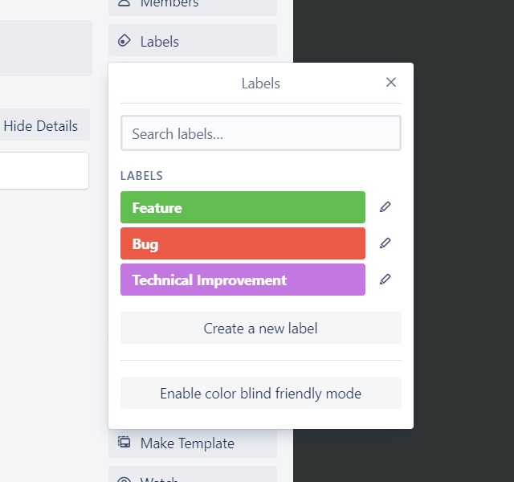
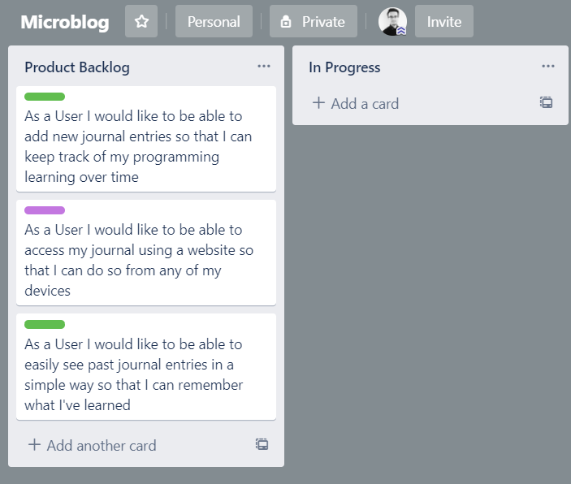
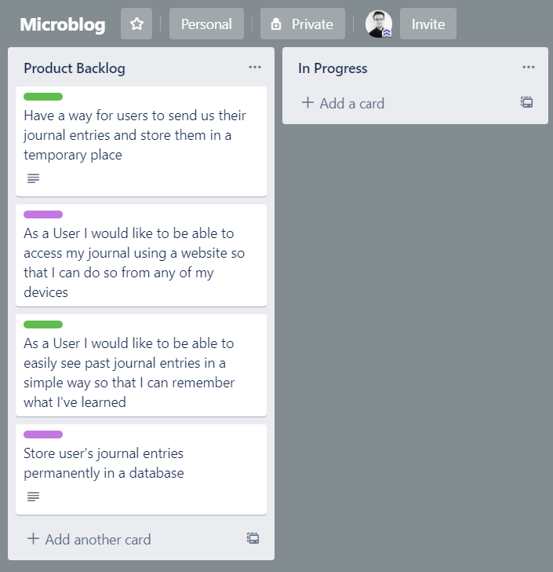
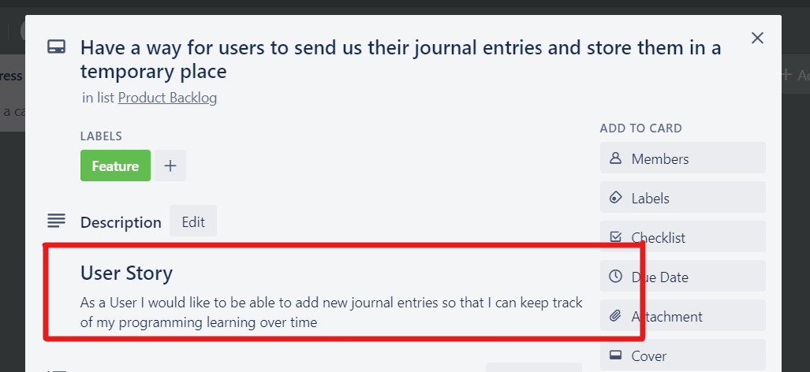
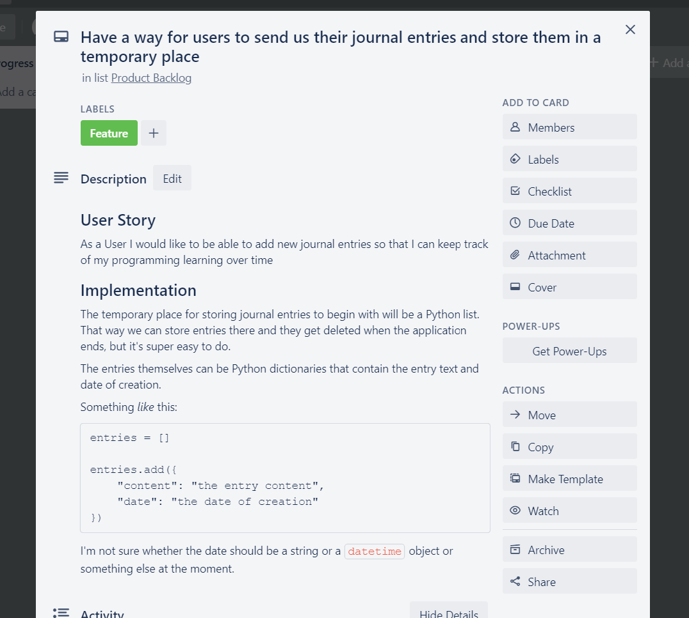

# Step 2: Populating the Backlog

Let's come up with a backlog of work for this project. That way, it'll be easier to develop _and_ also easier for you to know everything we're going to create.

This will give you a first-hand view into developing a software project and everything that is involved in it.

## Tools for keeping track of a backlog

Industry-standard tools are:

- Trello (free, simple, flexible)
- Notion (free, less simple, more flexible)
- JIRA (not free, not as simple, connects to other software, generally used more in larger teams)

I quite like Trello and Notion. For this project, I'll guide you through using Trello.

You can sign up at [https://trello.com](https://trello.com) and then create a Board.

Boards are initially empty, and you can create lists in them. Here's my default software project layout for a board:

## Big ideas first, break them down later

Don't get too bogged down with writing everything you can think of at the very start.

Instead, focus on big ideas. Focus on your users and User stories.

I'll write those first in the Product Backlog:

Once you've got down all your big user-focused ideas, you can order them by what users would want first. My order will be:

1. As a User I would like to be able to add new journal entries so that I can keep track of my programming learning over time.
2. As a User I would like to be able to access my journal using a website so that I can do so from any of my devices.
3. As a User I would like to be able to easily see past journal entries in a simple way so that I can remember what I've learned.

Note that user story 2 is not something that can be done on its own. It's a description of how users want to interact with our product. That's fine! It means we'll probably do it in parallel to a feature-centric user story.

## Types of backlog item in your project

In Trello you can click on a card to access more details. You can add descriptions to include more detail, add comments to collaborate with your team, add labels for organization, and much more.

I'll start by categorizing the work into three categories:

- Features (new functionality that users want)
- Technical Improvements (implementation work that needs to be done so things work better or at all)
- Bugs (things that need to be fixed)

You can do this by clicking on a card, then going into Labels, and selecting a colour for each category.

Inside each colour you can add some text so it's clearer what each one means:

I've gone ahead and done that, as well as deleted labels I don't need just now:

Then you can go through each card and add the appropriate label. This can sometimes be a bit subjective! I think stories 1 and 3 should be classed as "Features", and story 2 should be classed as a "Technical Improvement".

Once you've done that, you'll see this:

For more detail, if you want, you can press the semicolon key on your keyboard:

## Getting Started!

We've done enough with the Product Backlog for now. We've got the big ideas in there, and we know more or less how we want to get started.

Now it's time to think a bit more deeply about what you can get done and finished in a reasonable period of time, as well as how you'll do it. Normally a "reasonable period of time" is between 1 and 4 weeks. There are reasons for setting this timeframe, but we won't get into those in this course.

::: tip
Knowing how much work you can do in a certain amount of time comes with experience. To build this experience, it can help to "size up" each card with a scale you find comfortable (hours / days / 'effort').

That way when you complete a card, you can review and see if you over-estimated and under-estimated its size.
:::

I think that in a reasonable period we can get the first two stories done. But that's just gut feel. In order to get a better idea, let's think about _how_ we're going to actually produce the work.

### Be able to add new journal entries

What I'm thinking for this card is that we need two things:

- A text field or some way for users to enter their journal entry (e.g. an HTML form)
- A way to store the data they enter

I know that adding database functionality to an application involves some work, so I'm going to split this card into two.

The first card will involve getting the user's data and storing it in a temporary place.

The second card will involve saving the user's data into a database.

The layout of these cards will be a bit different. They refer to the same user story, but they'll be two distinct pieces of functionality.

This is my new Product Backlog based on this thinking:

What I've done here is:

- Created two cards, one for each distinct piece of implementation work
- Deleted the user story
- Copied the user story contents into each of the implementation parts (shown below)

Both card's descriptions look like this:

We don't want to forget about the reason why the cards exist, but we do want to subdivide our work.

Especially because I don't think we need to include database functionality immediately. We can add that later.

So for now, we'll allow users to add entries, but we won't add a database.

That way we can have Working Software that is missing some functionality, but we can get there sooner. Users can run it and use it, and we can see if this is something they'll be interested in.

The temporary place where we'll store user data will be a Python list, instead of a database. This is very easy to code, easy to add items to it, and easy to retrieve items for later.

I'll add that technical information to the card:

### Access the journal using a website

Users accessing the journal using a website is very much a technical concern. Other options would be to create a command-line application, a desktop app, or a mobile app.

This card can't really be divided further. However, we could create a command-line application first if we thought that was going to allow users to give us good feedback, with a lower cost.

I don't think that would be true in this case (I think our users would not want to use a command-line app at all), so we'll keep this card intact.

I'll add a bit of information though.

Web development uses HTML and CSS, so we don't have to add that to the card. However, for the back-end we do need to make some decisions. What language will we use? How will the back-end be built?

The development team in this case (me) is familiar with Flask, so that's the best way to provide value to users quickly. We'll use Flask for this project (also the course is about Flask, it would be weird if we used something else, wouldn't it!).

At this point since we've decided to use Flask, you could add some more technical information to the Feature card. For example, how the Flask app could be structured or what endpoints you might create.

However since that information is part of the course, I'm going to leave it out for now. We'll get to what all that means and how you'd do it later on!

## Updated work in a "reasonable period"

Our "reasonable period" will be two weeks. I think we can get the first two cards done, so I'll move those to "In Progress".

Our job every day is to think about how close we are to our goal. Does it look like we'll be able to achieve it? If we stop and think, can we foresee any blockers or problems that might prevent us from achieving the goal? Can we think of any more planning information that might help us reach the goal faster or better?

Every day we'll revisit the Trello board and make sure we're on track.

If your team has a "User representative" or you work with users directly, you might come back every day and add new user requests or things you think users would want.

You'd add those to the Product Backlog and always keep it sorted with the things to do next at the top. The sorting criteria could be: value to users, amount of feedback it would give the development team, ease of implementation, revenue the feature is expected to generate, or anything else. Just make sure you have some criteria for what work to do next!

## Next steps

Now that we've decided _what_ work we'll be doing and we've planned a bit _how_ we'll do it, we need to actually get on it!

The next step is to decide how users will interact with our application. What the journal entry will look like, what buttons we'll have, and that sort of stuff.

For that, I like wireframing. Let's do that in the next chapter!