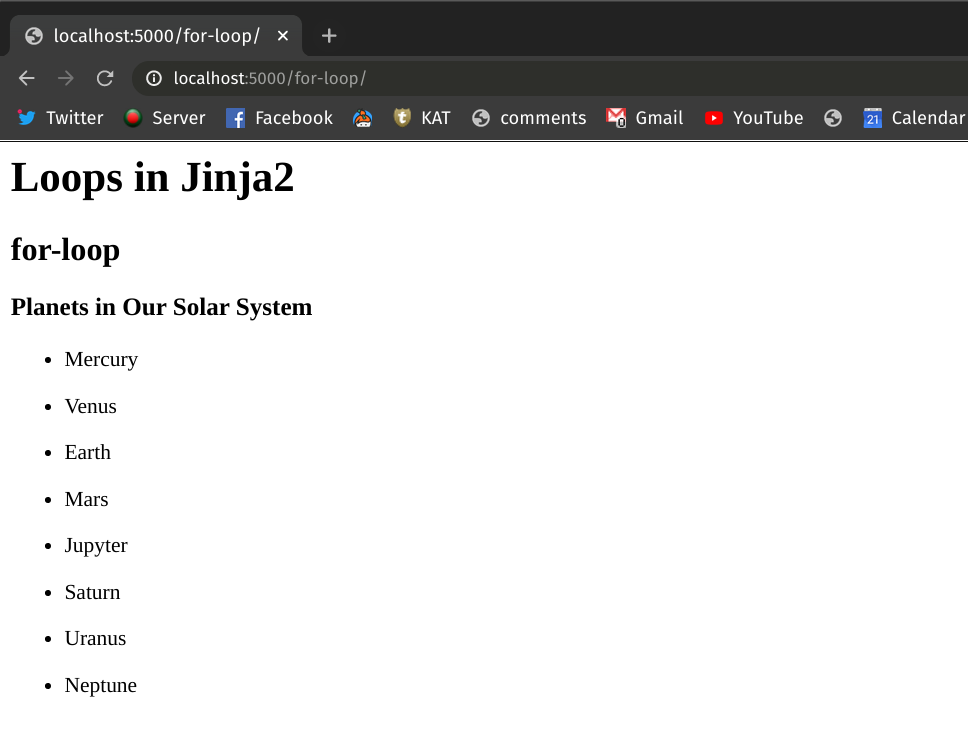
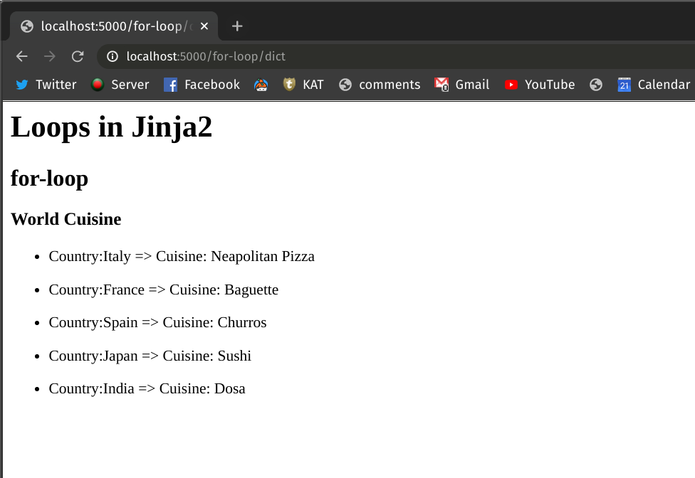
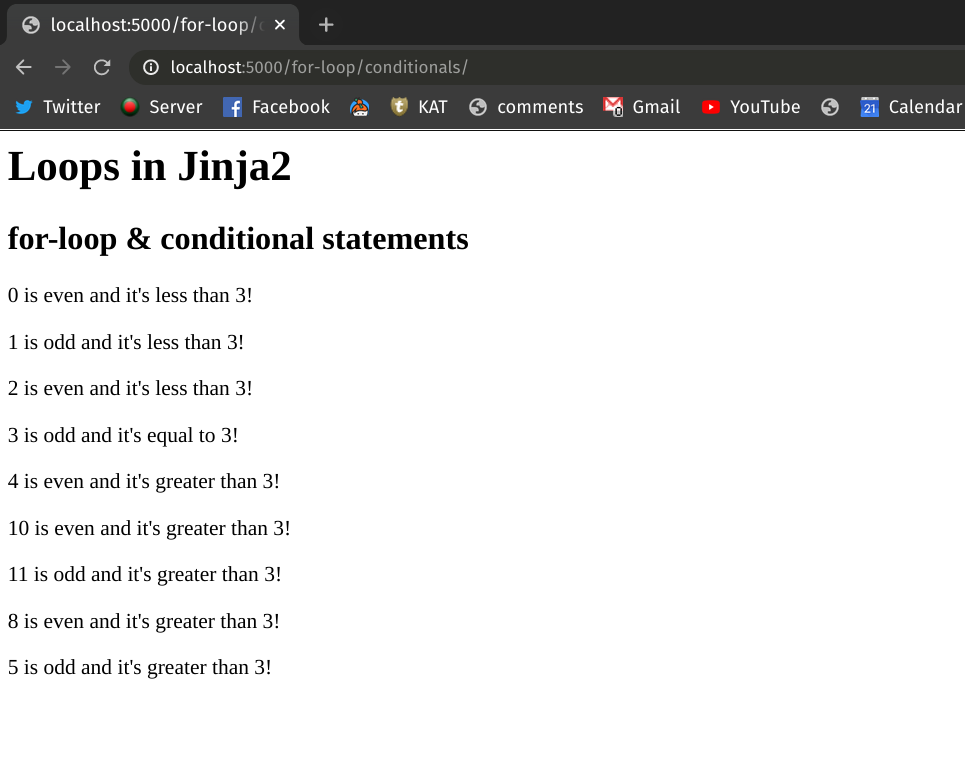

# Jinja2: Loops

Like conditional statements, Jinja2 templating language also allows you to write loop[^loop-jinja2] structures. However, only `for-loop` is supported and you need to simulate `while-loop` like behavior with `for-loop` if you need that.

Loops in Jija2 templates can make your workflow more flexible since you can embed some of your logic that requires the loop structure directly into the template.

## Looping Through List Objects

In this section, we'll see how you can add `for-loop` based logic to your Jinja2 template. Make a template named `for_loops.html` and place that in your Flask project's `/templates` folder. Now, add the following contents to the template:

```html
<!-- templates/for_loops.html -->

<h1>Loops in Jinja2</h1>
<h2>for-loop</h2>


    <h3>Planets in Our Solar System</h3>
    <ul>
        <li>{{ planet }}</li>
    </ul>

```

In the above template, we've traversed through a Python list containing the names of the planets in our solar system and showed them via an unordered HTML list. To render this, create an endpoint called `/for-loop/` and add the following code to the `app.py` file of your Flask project.

```python{10,21}
# app.py

from flask import Flask, render_template

app = Flask(__name__)


@app.route("/for-loop/")
def render_loops_for():
    planets = [
        "Mercury",
        "Venus",
        "Earth",
        "Mars",
        "Jupyter",
        "Saturn",
        "Uranus",
        "Neptune",
    ]
    return render_template("for-loop.html", planets=planets)
```

In line 10, notice how we've defined a list object containing the names of the planets and assigned it to a variable `planets`. Later on, in line 20, we've passed the variable to Flask's `render_template` method.

Now, if you run the Flask application and head over to `http://localhost:5000/loops-for` on your browser, you'll see a nicely rendered bullet list showing the names of the planets.



## Looping Through Dictionary Objects

Let's explore another example where you'll traverse through the keys and the values of a Python dictionary object and show them in an HTML list. In this case, our HTML template `for_loop_dict.html` will look like this:

```html
<!-- templates/for_loop_dict.html -->

<h1>Loops in Jinja2</h1>
<h2>for-loop</h2>

<h3>World Cuisine</h3>

    <ul>
        <li>Country:{{ key }} => Cuisine: {{ value }} </li>
    </ul>

```

In the above template, we've looped through the key-value pairs of a dictionary object called `cuisines` and showed them in an unordered HTML list. To render this, add the following code to your Flask project's `app.py`. This will create an endpoint called `/for-loop/dict/`.

```python{10,18}
# app.py

from flask import Flask, render_template

app = Flask(__name__)


@app.route("/for-loop/dict/")
def render_loops_for_dict():
    cuisines = {
        "Italy": "Neapolitan Pizza",
        "France": "Baguette",
        "Spain": "Churros",
        "Japan": "Sushi",
        "India": "Dosa",
    }
    return render_template("for_loop_dict.html", cuisines=cuisines)
```

In line 10, we've defined a dictionary object and assigned it into variable `cuisine`. Later in line 17, we've passed the dictionary object to the `render_template` method.

Run the Flask application and head over to `http://localhost:5000/loops-for/dict` on your browser. You should be able to see an unordered bullet list showing the desired contents.



## Mixing Loops & Conditionals

You can combine loops and conditionals to implement more complex logic in Jinja2 template. Let's create another HTML template file named `for_loop_conditionals.html` and place that in our `/template` folder. Add the following content to the file:

```html{6,7,10,13,17,20,23,26}
<!-- templates/for_loop_conditionals.html -->

<h1>Loops in Jinja2</h1>
<h2>for-loop & conditional statements</h2>


    {% if number % 2 == 0 and number > thresh %}
        <p>{{ number }} is even and it's greater than {{ thresh }}!</p>

    {% elif number % 2 == 0 and number < thresh %}
        <p>{{ number }} is even and it's less than {{ thresh }}!</p>

    {% elif number % 2 == 0 and number == thresh %}
        <p>{{ number }} is even and it's equal to {{ thresh }}!</p>

    {% elif number % 2 != 0 and number > thresh %}
        <p>{{ number }} is odd and it's greater than {{ thresh }}!</p>

    {% elif number % 2 != 0 and number < thresh %}
        <p>{{ number }} is odd and it's less than {{ thresh }}!</p>

    {% elif number % 2 != 0 and number == thresh %}
        <p>{{ number }} is odd and it's equal to {{ thresh }}!</p>

    
        <p>{{ number }} is rogue!</p>

    

```

In the above template, we've looped through a list of integers and checked if an individual integer is even or odd. Also, we've checked if the integer is greater than, equal to or less than a predefined threshold number, and printed a relevant message that reveals the status of the integer.

To render the template using Flask, add the following code to your project's `app.py` file:

```python{10,11}
# app.py

from flask import Flask, render_template

app = Flask(__name__)


@app.route("/for-loop/conditionals/")
def render_for_loop_conditionals():
    numbers = [0, 1, 2, 3, 4, 10, 11, 8, 5]
    thresh = 3
    return render_template("for_loop_conditionals.html", numbers=numbers, thresh=thresh)
```

In line 10, the variable `numbers` refers to a list of integer and the `thresh` variable in the next line denotes the threshold number. Later we've passed the variables in the `render_template` method.

Run the application and head over to [http://localhost:5000/for-loop/conditionals](http://localhost:5000/for-loop/conditionals) on your browser. You should be able to see a page like this:



## Conclusion

In this lesson, you've learned about using `for-loops` in the Jinja2 template. You've also learned how you can traverse through dictionary objects and combine `for-loops` with conditional statements to implement more complex logic directly in the template.

[^loop-jinja2]: [Loops in Jinja2 Template](https://jinja.palletsprojects.com/en/2.11.x/templates/#for)
