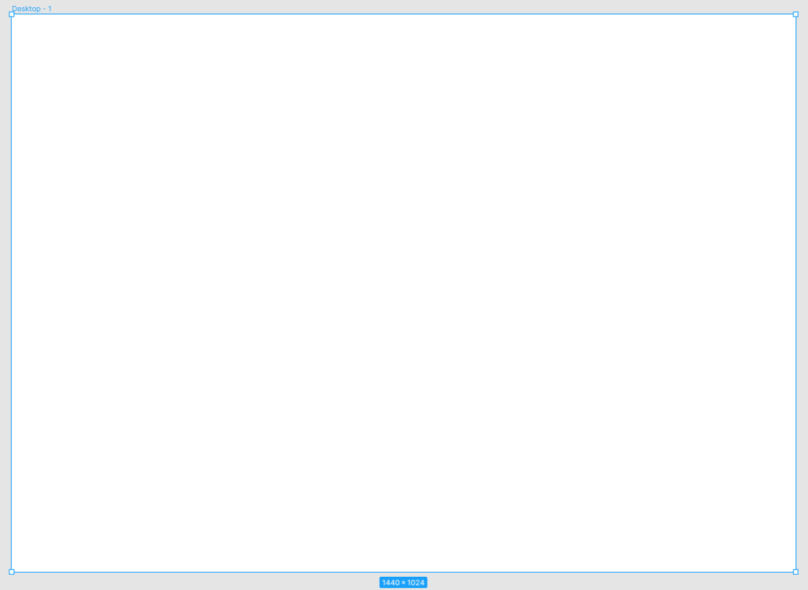
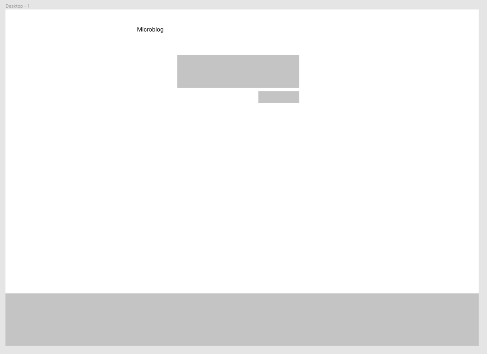
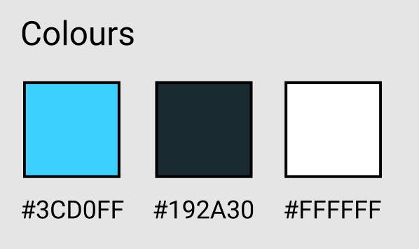
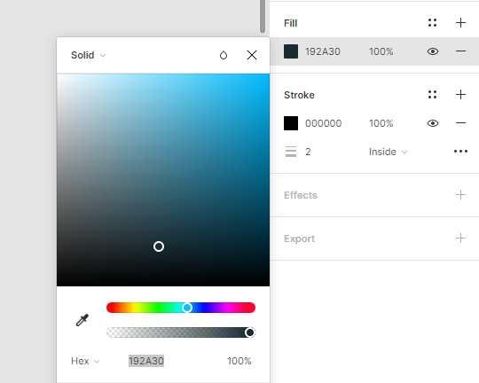
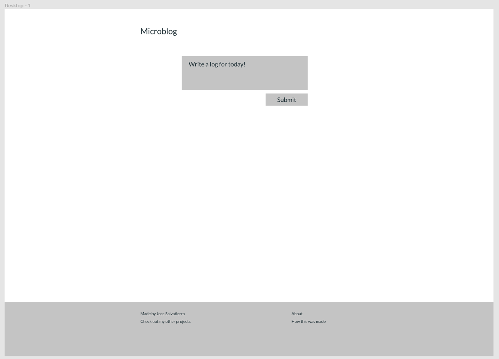
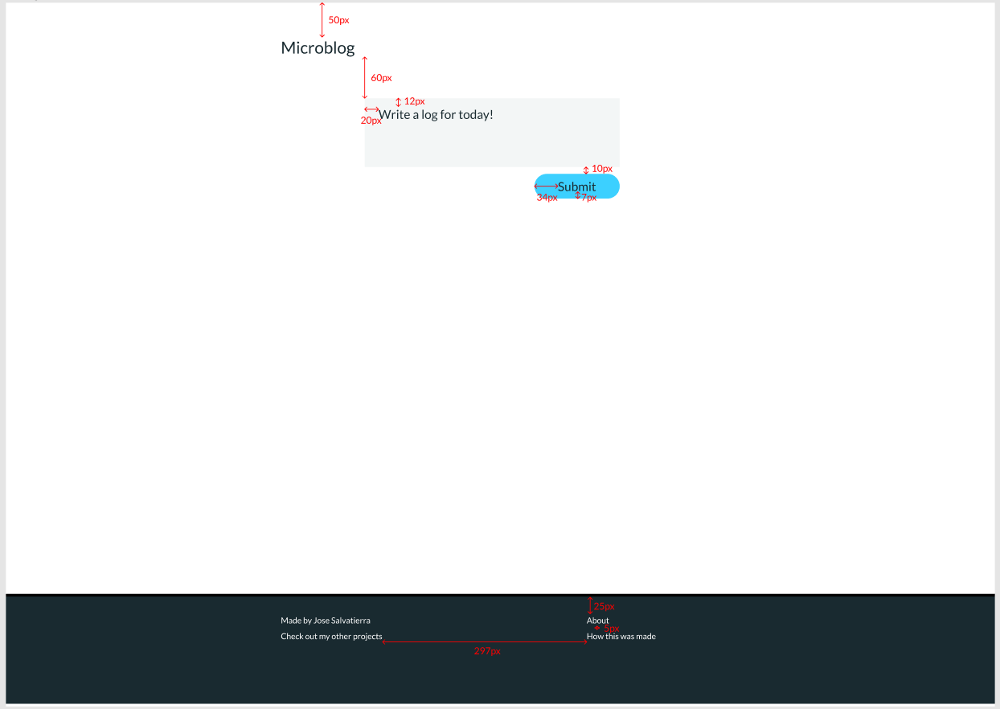

# Step 4: Better Design with Figma

In order to build an application, it helps to know exactly how much space will be left between items, how big fonts will be, what colours will be used, etc.

It's much easier to make those decisions with a design tool, where things are easy to change, rather than in code, where it can be a bit more difficult.

I like using [Figma](https://figma.com) as my design tool. It's free and very versatile. It runs in the browser, and it's easy to share your designs with others. There are others as well, like [Adobe XD](https://www.adobe.com/uk/products/xd.html) (also free) and [Sketch](https://www.sketch.com/).

## Designing the journal entry feature

For design, it really helps to get inspiration from other products that you enjoy using and find visually appealing. This is not a design course!

In terms of starting a design, we need to pick a screen size to work on first. Generally, and for most websites, you'll start with a small mobile screen size, and design for that. The reason we start with mobile is because nowadays mobile devices are the most popular devices in use in the web. Also, designing for a small screen means you must focus on what's most important. Enlarging the design and adding detail later is easier than doing it the other way round.

After designing the interface for a mobile display, you then start increasing the screen size until the existing design would benefit from changes. A design that works well on mobile won't necessarily work well on desktop, and vice versa.

For example, perhaps the screen looks very empty once the design is scaled up, and it makes sense to change how the content is organised.

For this website we'll stick to desktop only. We'll tackle mobile later on in the course!

I'll create a new Figma document for this project, and inside it create an Artboard (keyboard shortcut: `A`) with their standard desktop size: 1440x1024.

Then we can create the elements that we had in our wireframe: a header, an entry field, a submit button, and a simple footer.

To keep things simple, particularly in a new project, it helps to decide on a small palette of colours you'll use. For something very small like this project I like to pick a single colour that I'll use for accents and primary buttons, as well as a dark colour for text and a light colour for the background.

To make the text colour mesh together better with the chosen accent colour, you might slightly "tint" the text colour with the accent colour. Note that my text colour (`#192A30`) has a slight blue hue to it:

In addition to this, using fully black text can look a bit harsh&mdash;so if you don't have an accent color, just go slightly off-black with something like a dark grey!

::: tip
Picking colours is an art form, which I'm not all that good at!

Taking inspiration from other projects as well as using a colour-picker tool like [coolors](https://coolors.co/) can be a good start.
:::

### Picking a font

Every Operating System has a system font (for example, Segoe UI on Windows and San Francisco on Mac). You can use the system font for your projects to keep things familiar for users. The drawback is you won't really know what your project looks like on Mac if you use Windows, and vice-versa.

For more personality, you can pick a font for your project. Google Fonts has a large selection of free fonts to use in your websites, and including them in your websites is very easy.

For most projects I pick one of three fonts:

- Lato
- Roboto
- Open Sans

If you were designing a more premium project, you might go with a premium (paid) font.

For this project I'll use Lato. It has a good selection of weights (from very light to very bold), and I like the overall aesthetic. You can pick and change your font later, but you may have to do design adjustments because different fonts vary in look and feel as well as size.

### Working with colours

Next up I'll apply my colours to the design. The button will be accented. The text area needs to change in colour because at the moment it doesn't look like a place where users can type.

I'll change the footer colour to my text colour and invert the text colour so that it looks different from the rest of the page.

Note that I've had to come up with another colour for my text box. It's very normal to have to come up with a few different shades of colour for different use cases. Feel free to add that to the colour swatches!

### Rounded vs. square corners

There is no right or wrong answer when picking rounded vs. square corners.

Square corners generally look more polished and professional, but devoid of personality.

Fully circular corners look more playful and fun.

Slightly circular corners are somewhere in the middle.

For this project I went for fully circular corners in buttons, and square corners in other rectangles such as the text area.

To create a fully circular corner, we need to set the corner radius to at least half the height of the rectangle. Since my button is 36px high, I'll set the corner radius to 18px:

I also added a small border to the footer to separate it from the page. To create this type of border in Figma (only at the top of another rectangle), we do this by creating a second rectangle to act as the border:

Now we've got a pretty good starting point for our application!

I might normally be tempted to also do a quick design of what the entries will look like, so I have a better idea of what I'm working with. However, since we're focusing only on the "entries" feature, I'll leave that for later.

A couple things that we need to take note of:

- Font sizes
- Distance between elements (margin)
- Distance within element contents and its borders (padding)

Those will be vital when we come to re-create our page using HTML and CSS.

The good thing about having a design tool though, is that we can always come back to double-check our figures whenever we need!

## Next Step

The next step is to try to identify the actual HTML elements that we might use for this page, as well as how they exist relative to each other. What elements are beside other elements? What elements are inside other elements?

Let's do that in the next chapter!