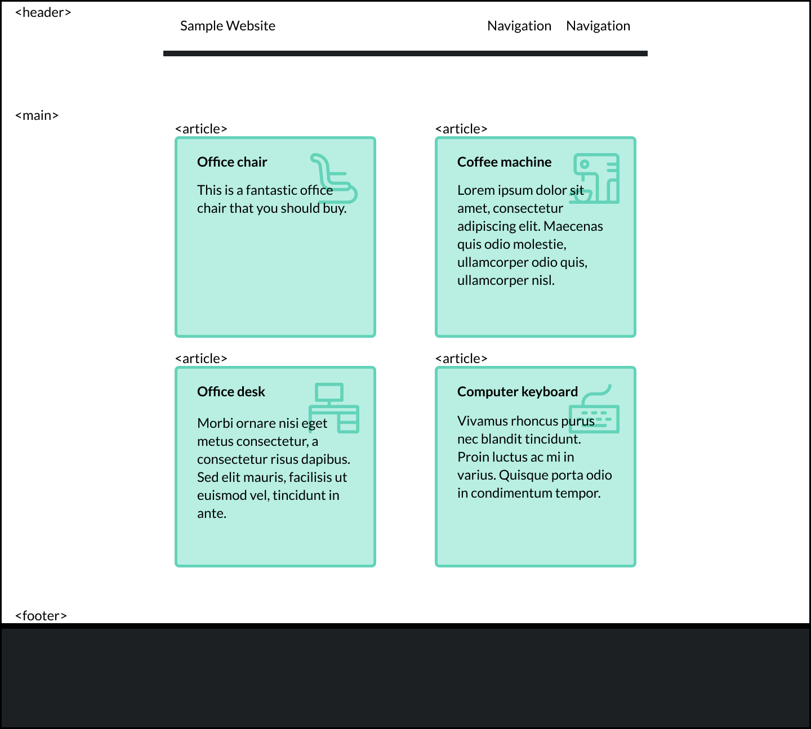
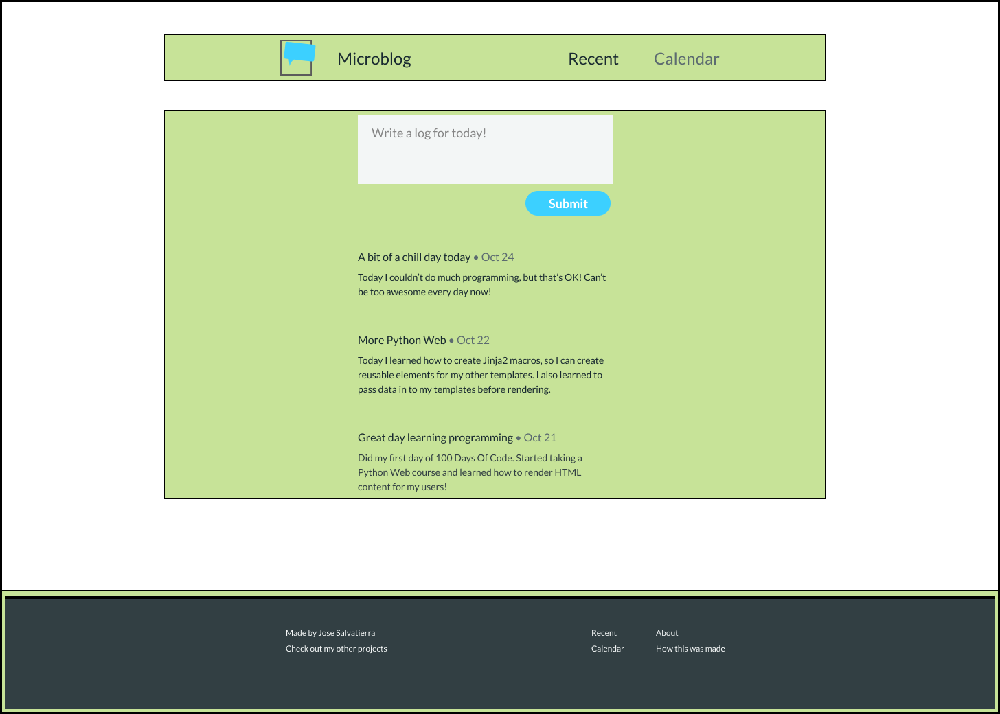
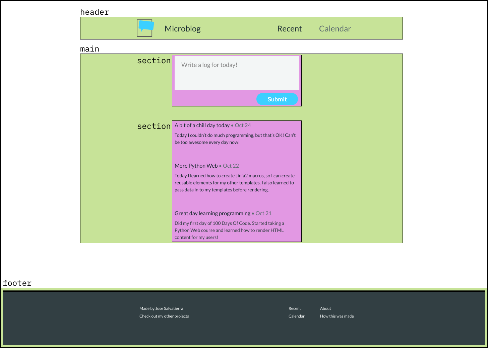

# Step 5: Creating the Page Structure

When coming up with a rough HTML structure for a page, the main thing to think about is the meaning of the elements we're using, and how we're nesting them.

## Layout

To understand what we mean by "layout", let me show you a fictitious website:



You can see that we have three distinct elements: a header, a footer, and a grid of elements.

A good HTML layout means that the elements used describe their content well. In this case, the layout is relatively simple. With a quick glance we've been able to identify that there'll be three elements:

```html
<header></header>
<main></main>
<footer></footer>
```

In many cases, it won't be so clear-cut! But we'll get to that later on in the course!

## Placing individual articles

Although it may sound obvious, the `<main>` element needs to contain the main content of the site. In our example, the main content is the grid of elements.

Each grid element in our example represents an item for sale, and it contains an image of the item, the item's name, and its price.

One item could be displayed on its own, outside the grid, in a different page entirely (e.g. a page created specifically for each item).

Since the grid elements make sense on their own, we'd use an `<article>` element to contain the information for each item, like so:

```html
<body>
  <header></header>
  <main>
    <article class="item"></article>
    <article class="item"></article>
    <article class="item"></article>
    <article class="item"></article>
    <article class="item"></article>
    <article class="item"></article>
  </main>
  <footer></footer>
</body>
```

Using CSS later on, we could lay out the `<article>` elements within `<main>` as a grid of 3 columns, as a single column, or any other way we choose.

The important part is that the content of the site is described accurately at this stage.

## The Microblog page structure

For our Microblog project, we need to look at the layout and structure of the page before we jump into coding as well.

You'll find that the Microblog is very similar, with just one more set of elements being required (the form to submit new entries).



We have:

- One column that contains all elements. Inside it:
  - A header
  - A central content area with a form and previous entries
  - A footer

The entire page is laid out as a column, and the central content area is a column too, with the form at the top and entries stacked one on top of another.

I would say that the main content of the page contains the form _and_ the entries.

To differentiate them as two distinct sections of the main content, the form and the articles will each be enclosed in a `section` tag.

So this is more or less what I'm envisioning the structure of the page will look like:



## Conclusion

Now that we've learned how to begin identifying the layout and nesting of elements in an HTML page, let's get to actually coding this page in our code editor!