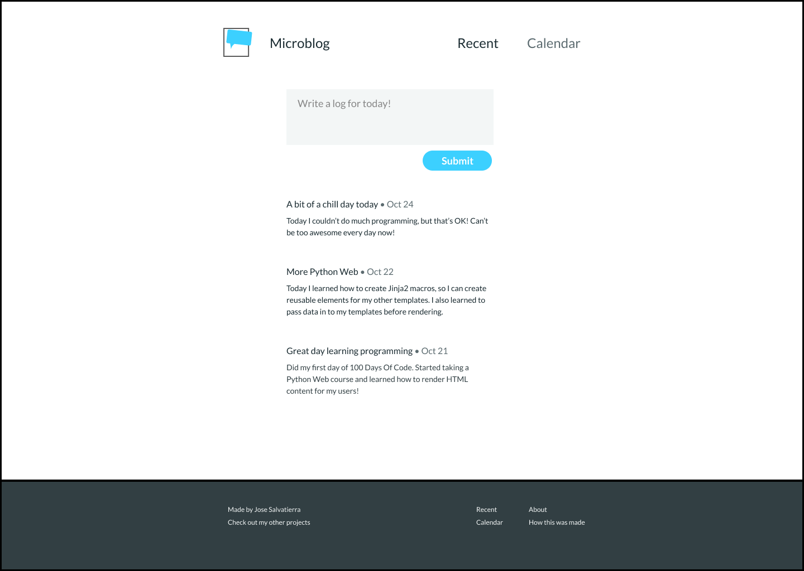

# Step 6: Coding the Page Structure

Finally, we can code the page structure and transfer all our thoughts into HTML.

In programming, and I find especially in HTML, there's no _one way to do things_. Everyone that codes in HTML finds a slightly different way to do the same thing: be that the nesting of elements, or the elements used, the class names, or really anything else.

## The main page structure

We've discussed that the structure of our Microblog is going to look like this:



There will be a central content column, with the header, main content, and footer.

I'll create a file , let's call it `home.html`, in my new project, and let's start coding that structure:

```html
<body>
    <header></header>
    <main>
    </main>
    <footer></footer>
</body>
```

Notice that the footer occupied the full width of the page. The header, however, does not. That's alright! We can style them differently using CSS later on.

Remember, HTML is about meaning. CSS is about styling!

## Adding the form and recent posts sections

Inside the `<main>` element, we'll add our form and recent posts.

The recent posts part of the page is what HTML considers a "section", because it is a distinct part of the site that can be identified by a heading, and doesn't have meaning on its own.

The form is also its own section because it is also a distinct part of the site. After coming up with the design, I remembered that every `section` element normally has a heading (although it doesn't _have_ to have one). We can use the `<section>` element for parts of the site that don't have a more specific semantic element to represent it.

I'll add headings to each section to more effectively convey what they are.

The form on its own cannot be accurately represented by an `<article>` element (which should have meaning on their own).

```html
<body>
    <header></header>
    <main>
        <section>
            <h1>Add new entry</h1>
            <form></form>
        </section>
        <section>
            <h1>Recent Posts</h1>
        </section>
    </main>
    <footer></footer>
</body>
```

## Adding recent posts

Finally, we can add the actual posts that we have already written using the form.

Each post is relatively self-contained, and makes sense on its own. I can imagine seeing recent posts as standalone elements of a page (e.g. in something like a Twitter feed, or as separate articles of a blog).

Hence each recent post will be an `<article>` element.

Inside each element, we'll have the heading, the date of posting, and the content:

```html
<article>
    <div>
        <h2>A bit of a chill day today</h2>
        <time datetime="24-10-2019">Oct 24</time>
    </div>
    <p>
        Today I couldn’t do much programming, but that’s OK!
        Can’t be too awesome every day now!
    </p>
</article>
```

I've contained the heading and the date inside a `<div>` element, because we don't have a more appropriate element that has more meaning. With a `div`, we'll keep the contained elements in one line using CSS.

For each new post we create, we'll add a new `<article>` element with that post's contents!

## The complete site structure

Now that we've got everything, let's take a look at our site structure holistically:

```html
<body>
    <header></header>
    <main>
        <section>
            <h1>Add new entry</h1>
            <form></form>
        </section>
        <section>
            <h1>Recent Posts</h1>
            <article>
                <div>
                    <h2>A bit of a chill day today</h2>
                    <time datetime="24-10-2019">Oct 24</time>
                </div>
                <p>
                    Today I couldn’t do much programming, but that’s OK!
                    Can’t be too awesome every day now!
                </p>
            </article>
            <article>
                <div>
                    <h2>A bit of a chill day today</h2>
                    <time datetime="24-10-2019">Oct 24</time>
                </div>
                <p>
                    Today I couldn’t do much programming, but that’s OK!
                    Can’t be too awesome every day now!
                </p>
            </article>
        </section>
    </main>
    <footer></footer>
</body>
```

There are three things we haven't discussed yet: the contents of the header, the form, and the footer.

Let's talk about those in that order, in the next few lectures!