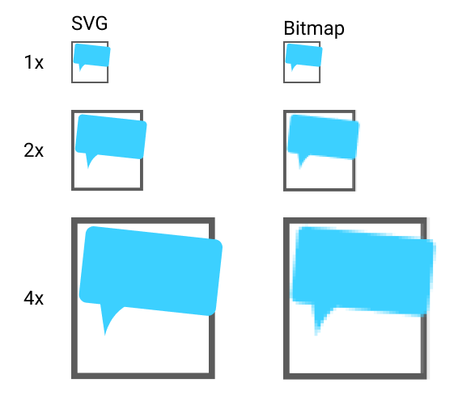
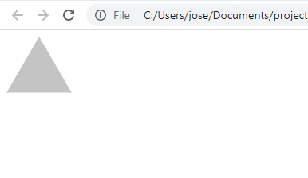

# What are SVGs?

- What is an SVG? SVG vs. Bitmap
- Why use that instead of a bitmap image?

An SVG, or **S**calable **V**ector **G**raphics, image is a type of image that, instead of being defined in pixels, is defined by mathematical functions.

That means that, in theory, we can expand or contract an SVG image endlessly without any loss in quality.

In contrast to this, traditional images that are defined by pixels are called **bitmaps**.

Here's an example of a bitmap image at three different sizes, compared to an SVG image:



You can see that as the bitmap image gets larger, the number of pixels doesn't _increase_. The pixels get larger, so they are more obvious.

However, since the SVG is defined as a mathematical function, as it gets larger the function just creates more equally-sized pixels dynamically.

::: tip SVGs are usually smaller
Since SVGs generally smaller in size, that means that we can send SVGs to our users over the internet more easily. They'll download faster, and they'll take up less bandwidth in our servers (which in turn, usually lowers our costs). It's important to note that SVGs are not smaller when used for photos!
:::

## Embedding SVGs inside HTML documents

The language used to create SVGs is very similar to HTML because both derive from the same parent language: XML.

This is what the code for a simple triangle looks like:

```xml
<svg width="82" height="71" viewBox="0 0 82 71" fill="none" xmlns="http://www.w3.org/2000/svg">
    <path d="M41 0L81.7032 70.5H0.296806L41 0Z" fill="#C4C4C4"/>
</svg>
```

You can see that it is similar to HTML: there are tags and attributes.

We won't cover how to code your own SVGs[^code-own-svg] in this course, since Figma will do that for us with a visual interface. However, it is something you _can_ learn. Understanding the code can sometimes be handy though, as you can do things like modify the size (using the `width` and `height` attributes of the `svg` tag).

Once we have that SVG code, we can just put it inside an HTML document. The browser will be able to understand it, and draw the SVG for us.

### Drawing an SVG with the browser

Let's create an HTML file, which I'll call `example-svg.html`. Inside it, just put the SVG code from above.

Then, open it up with your browser by right-clicking the file.

You'll see something like this:



Try changing the SVG code, and see what happens! You'll see that by changing the `width` and `height` properties of the `svg` tag, the image changes in size (even without changing the `path` tag)!

The `viewBox` property controls how much of the SVG you can see, while `width` and `height` tell the browser how many pixels to draw on in the page. Later on we'll learn how to change the width and height using CSS.

## Conclusion

For now though, we've learned what SVGs are: XML code that encodes mathematical functions. These functions describe the shape, colours, and other properties of graphics.

[^code-own-svg]: [Everything You Need To Know About SVG (CSS-Tricks)](https://css-tricks.com/lodge/svg/)