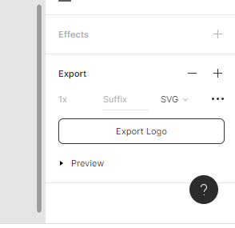
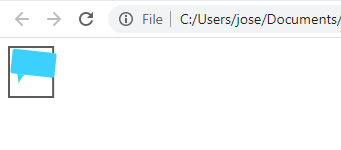

# How to include images in an HTML document

- How to get an SVG from Figma
- How to include an SVG in your HTML document
- Example with a Bitmap image

## How to make an SVG

By far the easiest way to make an SVG from scratch is to use a design tool like Figma or Sketch, and export the drawing as an SVG.



I've included the Microblog logo, as an SVG, in the resources section of this lecture.

## How to include an SVG in your HTML document

We've learned that we can embed the SVG code directly in our HTML documents. However, that can sometimes make the HTML code a bit messy (particularly with those longer SVG images!).

So instead what you can do is save the SVG code as a file, and place it in the same folder as your HTML document.

For example, you could have this folder structure:

```
my_project
  | - home.html
  | - logo.svg
```

Then, we can write some code in the HTML document that will take care of telling the browser to load the SVG and display it in the correct place.

We'll do this in our existing code, inside the `<header>` element:

```html
<body>
    <header>
        
    </header>
    <!-- The rest of the code continues as per earlier lectures -->
</body>
```

When the browser loads this HTML document, it will run through it and find the `img` tag. Then, it will request the SVG from the server (or, in this case, our file system).

It will load the SVG image and then place it inside the `body` element.

<!-- TODO: Fix this image so it contains microblog code -->


If for any reason the image cannot be loaded (e.g. we misspelled it), we'll get a "broken image" symbol and the alternative text (the `alt` property) will be shown.

<!-- TODO: Fix this image so it contains microblog code -->


::: tip Other image types
You can include any image type, not just SVG, with the `img` tag. For example:

```html

```
:::