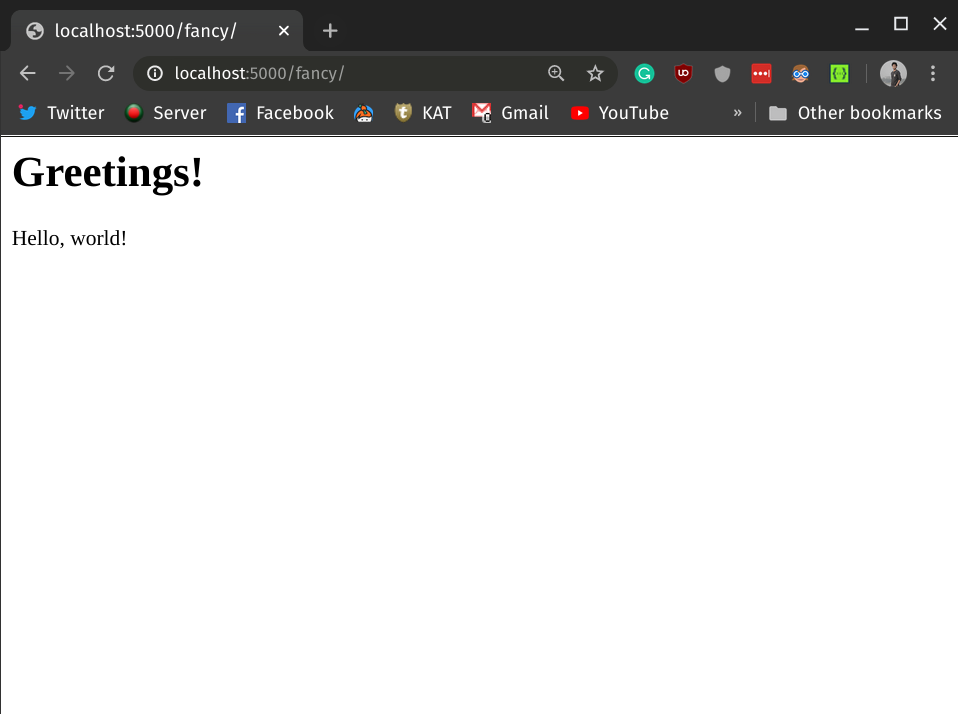

# "Hello, world!" with Flask

## Why Flask?

Flask[^flask] is known as a lightweight WSGI[^wsgi] application framework. A framework is a code library that makes a developer's life easier while writing application code. Flask helps us build reliable, scalable, and maintainable web applications

Flask lets you quickly get started with building web applications in pure Python. In the following sections, you'll install Flask on your local development machine and make a simple 'Hello, world!' application. Let's jump right in!

## Installing Flask

Assuming you've got Python 3 installed on your local development machine, let's create a virtual environment[^venv] and install Flask in it. For this demonstration, we'll be using `Python 3.8`. Run the following commands on your terminal based on your operating system:

### Linux / MacOS:

Create the virtual environment:

```bash
python3 -m venv venv
```

Activate the virtual environment:

```bash
. venv/bin/activate
```

Install Flask via pip:

```bash
pip install Flask
```

### Windows

Create the virtual environment:

```bash
py -3 -m venv venv
```

Activate the virtual environment:

```bash
venv\Scripts\activate
```

Install Flask via pip:

```bash
pip install Flask
```

If you're having trouble with your installation, checkout this detailed installation guide here[^flask-install].

## Making a "Hello, World!" Flask Application

If you go to the Flask[^flask-web] website, you are welcomed with a very simple example application that has just five lines of code. We'll be building the same application here just to get a hang of how the entire process works.

### Prepare Your Application Directory

We'll create a folder called `hello-world` and put all our application code inside that. Go to your development directory (where you want to place your code) and run the following command to create the `hello-world` folder:

```bash
mkdir hello-world
```

### Write Your First "Hello, World!" Application

Now go to the `hello-world` folder that you've just created and create a new Python file called `app.py`. Add the following lines to the `app.py` file.

```python
# app.py
from flask import Flask

app = Flask(__name__)


@app.route("/")
def hello_world():
    return "Hello, World!"
```

Let's see what did the above code do:

* First we imported the `Flask` class.

* Then we've create an instance of the class and assigned that to `app` variable. This instance of the class will be our WSGI application.

* We then use the `route()` decorator to tell Flask what URL should trigger our function.

* The function is given a unique name and returns the message we want to display in the user’s browser.

### Run the Application

To run the application, you can either use the `flask` command or Python’s `-m` switch with `Flask`. Before you can do that you need to tell your terminal the application to work with by exporting the `FLASK_APP` environment variable. Also, during development, you should turn on the debugging mode by setting the `FLASK_ENV` environment variable to `development`. Run the following commands if you're on **Linux/MacOS**:

```bash
export FLASK_APP=app.py
export FLASK_ENV=development
flask run
```


Now, if you're on **Windows** then export `FLASK_APP` and `FLASK_ENV` variables on *Command Prompt* like this:

```
C:\path\to\app>set FLASK_APP=app.py
C:\path\to\app>set FLASK_ENV=development

```

Or on *Powershell*, run:

```
PS C:\path\to\app> $env:FLASK_APP = "app.py"
PS C:\path\to\app> $env:FLASK_ENV = "development"
```

Then run:

```
python -m flask run
```

Now using your browser, head over to [http://127.0.0.1:5000/](http://127.0.0.1:5000/), and you should see your 'Hello, world!' greeting.


Here, you've created your first API. An Application Programming Interface (API) allows two systems to communicate with one another. Running the Flask application creates a server that allows a client to access the 'Hello, world!' string. Your browser is the client that accesses the server via an API endpoint. The final part of the link `http://127.0.0.1:5000/` that you've used to interact with the API is called an endpoint. When the browser accessed the URL, the server runs the `hello_world()` function and returns a string that the browser then displays. The `route()` decorator takes care of the back and forth communication between the server and the client.

## Serving an HTML String

Let's make our 'Hello, world!' app a bit more exciting. Here, you'll create a new endpoint and display the 'Hello, world!' greeting in a fancy `html` format. Head over to your `app.py` file and modify it like the following:

```python
# app.py
from flask import Flask


app = Flask(__name__)


@app.route("/")
def hello_world():
    return "Hello, World!"


@app.route("/fancy")
def hello_world_fancy():
    greetings = """
    <html>
    <body>

    <h1>Greetings!</h1>
    <p>Hello, world!</p>

    </body>
    </html>
    """
    return greetings
```

Notice, how we've introduced another function called `hello_world_fancy()` and decorated it like the previously defined `hello_world()` function. This time the `route()` decorator defines a new endpoint named `/fancy`. Flask will automatically append this endpoint to your host URL `http://localhost:5000`. So, the final URL will be [http://localhost:5000/fancy](http://localhost:5000/fancy). If you've stopped your server, then run the application again by following the previously mentioned instructions. Then head over to [http://localhost:5000/fancy](http://localhost:5000/fancy) on your browser and you'll be greeted by a fancier 'Hello, world!' page.



## Conclusion

In this lesson you've learned how to build and serve simple APIs with Flask framework. You've also learned how endpoints work, how to access the server from a client and how to add new routes to your app to send HTML to the browser.

[^flask-web]: [Flask Website](https://flask.pocoo.org)
[^flask]: [Flask Documentation](https://flask.palletsprojects.com/en/1.1.x/)
[^wsgi]: [Getting Started with WSGI](https://wsgi.readthedocs.io/en/latest/what.html)
[^venv]: [Python virtual environment](https://docs.python.org/3/library/venv.html#:~:text=A%20virtual%20environment%20is%20a,part%20of%20your%20operating%20system.)
[^flask-install]: [Installing Flask](https://flask.palletsprojects.com/en/1.1.x/installation/)
