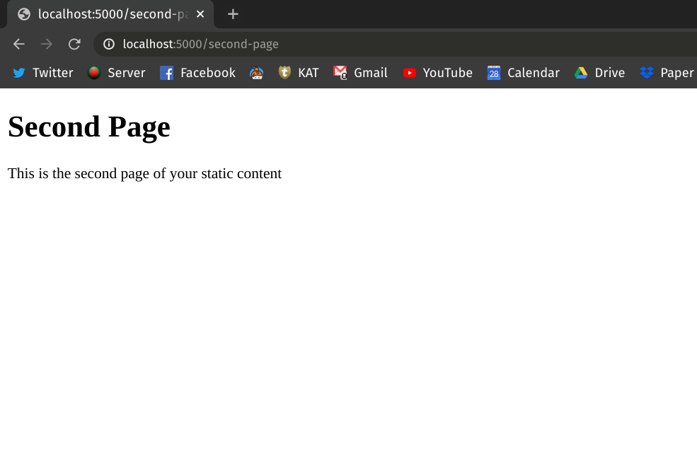

# Using render_template to Send Longer HTML Strings

You've already learned about APIs, endpoints and how you can make quick APIs with Flask. Also, you've seen how Flask lets you send HTML decorated texts to your browser.

Writing HTML strings directly into your application code is okay as long as the size of the string is minimal. However, if you want to send multiple HTML pages or large HTML strings to your browser, embedding that directly into your application code may not be the best idea.

In this lesson, we'll see how you can write separate HTML files and use Flask's `render_template()` method to send your static contents.

## Static Content

Static content[^static-content] is any content that can be delivered to an end user without having to be generated, modified, or processed. The server delivers the same file to each user, making static content one of the simplest and most efficient content types to transmit over the internet. In our case, the HTML files that we want to send to the browser are static contents.

Any kind of file can be served as static content as long as it does not change in response to a user's actions or inputs. This includes images, JavaScript files, HTML files, CSS files, videos, Flash files etc.


## Render HTML Strings

By now, you already know that you can send HTML strings to your browser in the following manner:

```python
# app.py
from flask import Flask


app = Flask(__name__)


@app.route("/fancy")
def hello_world_fancy():
    greetings = """
    <html>
    <body>

    <h1>Greetings!</h1>
    <p>Hello, world!</p>

    </body>
    </html>
    """
    return greetings
```

Running the code starts the Flask server and accessing the URL [http://localhost:5000/fancy](http://localhost:5000/fancy) gives you this nicely formatted greeting in your browser:


While this is good for simple cases, in the next section, you'll see how you can manage and serve larger HTML content with Flask.

## Render HTML Pages

### Create the Static Files

Let's create a folder named `templates` inside your project folder. Create two empty HTML files called `first_page.html` and `second_page.html` in the `templates` folder. Your project folder should have the following structure:

```
.
├── app.py
└── templates
    ├── first_page.html
    └── second_page.html
```

Now, go ahead and add the following contents to your static files.

**First page:**

```html
<!-- first_page.html -->

<!DOCTYPE html>
<html>

<body>

    <h1>First Page</h1>
    <p>This is the first page of your static content</p>

</body>

</html>
```

**Second Page:**

```html
<!-- second_page.html -->

<!DOCTYPE html>
<html>

<body>

    <h1>Second Page</h1>
    <p>This is the second page of your static content</p>

</body>

</html>
```

The above static files are kept simple for demonstration purposes. In real life, you'll be dealing with much larger and more complex static files.

### Render the Files via render_template

Now that you've created the necessary HTML static files, let's see how you can use `render_template` to send the files to the browser. Here, the following code snippet should be familiar to you. Here, we'll be exposing two API endpoints for accessing the static files from your browser:

<!-- Lines to highlight: 4, 11, 16 -->

``` python
# app.py

from flask import Flask
from flask import render_template

app = Flask(__name__)


@app.route("/first-page")
def render_first_page():
    return render_template("first_page.html")


@app.route("/second-page")
def render_second_page():
    return render_template("second_page.html")
```

In the above code snippet, we've imported the `render_template` method from Flask and used that to send the static contents to the browser. Using the route decorator we've created two different endpoints to send the pages. Notice we didn't mention the full path of the HTML files inside the `render_template()` method; Flask automatically looks for static files in the `templates` folder.

Now run the application (refer to the previous lesson[^run-flask] if you don't know how to run Flask applications) and go to following URL to view the `first_page.html`:


[http://localhost:5000/first-page](http://localhost:5000/first-page)


To access `second_page.html`, go to:


[http://localhost:5000/second-page](http://localhost:5000/second-page)



## Conclusion

In this lesson, you've learned the what static contents are and how you can send static HTML files to your browser using Flask's `render_template` method.

[^static-content]: [Static Content](https://blog.stackpath.com/static-content/)
[^run-flask]: [Running Flask Applications](https://github.com/tecladocode/python-web-2020/tree/master/curriculum/section06/lectures/01_hello_world_flask#run-the-application)
