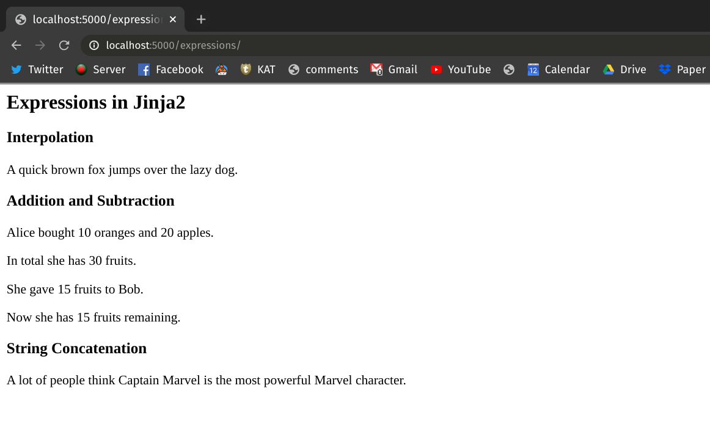

# Jinja2: Expressions & Data Structures

By now you already know how to use Jinja2 and Flask's `render_template` method to interpolate placeholder values into HTML files and send them to the browser. Jinja2 also lets you evaluate a limited[^jinja2-limitations] number of Python expressions and data structures.

In this lesson, you'll see how you can evaluate different Python expressions, incorporate a few data structures in Jinja2 and render them using the `render_template` method.

## What is an Expression?

A Python expression[^expression] is any piece of code—like a number, a string, or a class instance—that evaluates down to a single value.

> An expression is an instruction that combines values and operators and always evaluates down to a single value.

For example, `>>> foo = 2 + 2` is an expression because it evaluates to a single value `4`. In contrast, a Python instruction that doesn't evaluate down to a single value is generally known as a statement (i.e. an `if-else` statement).

## Expressions in Jinja2

This section explains how you can evaluate Python expressions in Jinja2 and render them via the `render_template` method.

Let's perform some basic operations like **addition**, **subtraction** and **string concatenation** via Jinja template. To follow along, create a new HTML template file named `expressions.html` in the `/templates` folder of your Flask project's directory. The content of the file should look like this:

<!-- Lines to highlight: 20, 24, 28, 34 -->

```html
<!-- templates/expressions.html -->

<h2>Expressions in Jinja2</h2>

<h3>Interpolation</h3>

<p>
    A quick {{ color }} {{ animal_one }} jumps over the lazy
    {{ animal_two }}.
</p>

<h3>Addition and Subtraction</h3>

<p>
    Alice bought {{ orange_amount }} oranges and {{ apple_amount }} apples.
</p>

<p>
    In total she has {{ orange_amount + apple_amount }} fruits.
</p>

<p>
    She gave {{ donate_amount }} fruits to Bob.
</p>

<p>
    Now she has {{ orange_amount + apple_amount - donate_amount }}
    fruits remaining.
</p>

<h3>String Concatenation</h3>

<p>
    A lot of people think {{ first_name + ' ' + last_name }} is the most
    powerful Marvel character.
</p>
```

The header tags in of the above HTML file denotes what sort of expression operations are taking place in the template. In line **19**, **23**, **27** and **34** notice how you can perform different operations like addition, subtraction and string concatenation inside the double braces `{​{ }​}`.

Now we'll evaluate these expression operations and render the results using the `render_template` method. Let's create a new endpoint in our `app.py` file named `/expressions/` and perform rendering there.

<!-- Lines to highlight: 27, 37 -->

```python
# app.py

from flask import Flask
from flask import render_template

app = Flask(__name__)


@app.route("/expressions/")
def render_expressions():

    # interpolation
    color = "brown"
    animal_one = "fox"
    animal_two = "dog"

    # addition and subtraction
    orange_amount = 10
    apple_amount = 20
    donate_amount = 15

    # string concatenation
    first_name = "Captain"
    last_name = "Marvel"

    kwargs = {
        "color": color,
        "animal_one": animal_one,
        "animal_two": animal_two,
        "orange_amount": orange_amount,
        "apple_amount": apple_amount,
        "donate_amount": donate_amount,
        "first_name": first_name,
        "last_name": last_name,
    }

    return render_template("expressions.html", **kwargs)
```

In the above file, we just have to define the placeholder variables and the evaluation part will be taken care by the Jinja2 template engine.

In line **26**, we've taken advantage of Python dictionary to pass keyworded arguments to the `render_template` method. Instead of supplying all the arguments directly, you can use dictionary unpacking operator `**` (in line **37**) to pass the arguments implicitly while keeping the `render_template` method clean.

If you run the Flask application and go to [http://localhost:5000/expressions/](http://localhost:5000/expressions/) URL in your browser, you'll see that Jinja2 has evaluated all the expression operations defined in the `expressions.html` file and filled in the corresponding placeholder values.


## Conclusion

In this lesson you've learned how you can evaluate expressions in HTML files using the Jinja2 template engine.

[^expression]: [What is an expression in Python?](https://stackoverflow.com/a/30114220/8963300)

[^jinja2-limitations]: [Putting logics in templates](https://jinja.palletsprojects.com/en/2.10.x/faq/#isn-t-it-a-terrible-idea-to-put-logic-into-templates)
