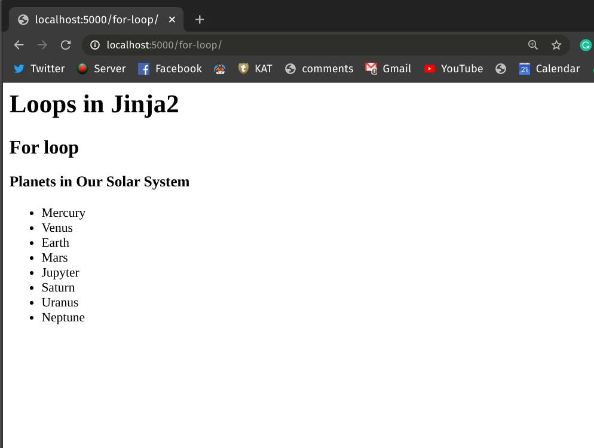
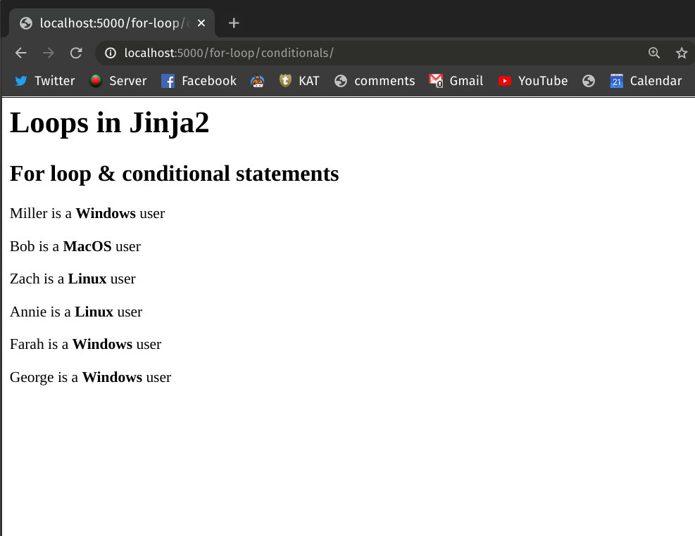

# Jinja2: Loops

Like conditional statements, the Jinja2 templating language also allows you to write loop[^loop-jinja2] structures. However, Jinja2 only supports *for loops*. If you want to use a while loop, you'll need to simulate its behaviour with a for loop.


## Looping Through List Objects

In this section, we'll see how you can add *for loop* logic to your Jinja2 template. Make a template named `for_loop.html` and place that in your Flask project's `/templates` folder. Then, add the following contents to the template:

```html
<!-- templates/for_loop.html -->

<h1>Loops in Jinja2</h1>
<h2>For loop</h2>
<h3>Planets in Our Solar System</h3>

<ul>
    
        <li>{{ planet }}</li>
    
</ul>
```

In the above template, we've traversed through a Python list containing the names of the planets in our solar system and showed them via an unordered HTML list. To render this, create an endpoint called `/for-loop/` and add the following code to the `app.py` file of your Flask project.

<!-- Lines to highlight: 10, 21-->

```python
# app.py

from flask import Flask, render_template

app = Flask(__name__)


@app.route("/for-loop/")
def render_loops_for():
    planets = [
        "Mercury",
        "Venus",
        "Earth",
        "Mars",
        "Jupyter",
        "Saturn",
        "Uranus",
        "Neptune",
    ]
    return render_template("for-loop.html", planets=planets)
```

In line 10, notice how we've defined a list object containing the names of the planets and assigned it to a variable `planets`. Later on, in line 20, we've passed the variable to Flask's `render_template` method.

Now, if you run the Flask application and head over to [http://localhost:5000/for-loop](http://localhost:5000/for-loop) on your browser, you'll see a nicely rendered bullet list showing the names of the planets.



## Looping Through Dictionary Objects

Let's explore another example where you'll traverse through the keys and the values of a Python dictionary object and show them in an HTML list. In this case, our HTML template `for_loop_dict.html` will look like this:

```html
<!-- templates/for_loop_dict.html -->

<h1>Loops in Jinja2</h1>
<h2>For loop</h2>
<h3>World Cuisine</h3>

<ul>
    
        <li>Country: {{ key }} => Cuisine: {{ value }}</li>
    
</ul>
```

In the above template, we've looped through the key-value pairs of a dictionary object called `cuisines` and showed them in an unordered HTML list. To render this, add the following code to your Flask project's `app.py`. This will create an endpoint called `/for-loop/dict/`.

<!-- Lines to highlight: 10, 18 -->

```python
# app.py

from flask import Flask, render_template

app = Flask(__name__)


@app.route("/for-loop/dict/")
def render_loops_for_dict():
    cuisines = {
        "Italy": "Neapolitan Pizza",
        "France": "Baguette",
        "Spain": "Churros",
        "Japan": "Sushi",
        "India": "Dosa",
    }
    return render_template("for_loop_dict.html", cuisines=cuisines)
```

In line 10, we've defined a dictionary object and assigned it into variable `cuisine`. Later in line 17, we've passed the dictionary object to the `render_template` method.

Run the Flask application and head over to [http://localhost:5000/for-loop/dict](http://localhost:5000/for-loop/dict) on your browser. You should be able to see an unordered bullet list showing the desired contents.


## Mixing Loops & Conditionals

You can combine loops and conditionals to implement more complex logic in Jinja2 template. Let's create another HTML template file named `for_loop_conditionals.html` and place that in our `/template` folder. Add the following content to the file:

<!-- Lines to highlight: 6, 10, 13 -->

```html
<!-- templates/for_loop_conditionals.html -->

<h1>Loops in Jinja2</h1>
<h2>For loop & conditional statements</h2>


    
        <p>{{ user }} is a <b>Windows</b> user</p>

    
        <p>{{ user }} is a <b>MacOS</b> user</p>

    
        <p>{{ user }} is a <b>Linux</b> user</p>
    

```

In the above template, we've looped through a list of tuples where each tuple has two elements. The first element of the tuple denotes a user's name and the second one denotes the name of the operating system that the user uses. We've checked the type of the operating systems via conditional statements and printed different messages accordingly.

To render the template using Flask, add the following code to your project's `app.py` file:

<!-- Lines to highlight: 10, 20 -->

```python
# app.py

from flask import Flask, render_template

app = Flask(__name__)


@app.route("/for-loop/conditionals/")
def render_for_loop_conditionals():
    user_os = [
        ("Miller", "Windows"),
        ("Bob", "MacOS"),
        ("Zach", "Linux"),
        ("Annie", "Linux"),
        ("Farah", "Windows"),
        ("George", "Windows"),
    ]

    return render_template("for_loop_conditionals.html", user_os=user_os)
```

In line 10, the variable `user_os` refers to a list of tuples containing the user's names and their respective operating system of choice. Later, we've passed the variables in the `render_template` method.

Run the application and head over to [http://localhost:5000/for-loop/conditionals](http://localhost:5000/for-loop/conditionals) on your browser. You should be able to see a page like this:



## Conclusion

In this lesson, you've learned about using *for loops* in a Jinja2 template. You've also learned how you can traverse through dictionary objects and combine *for loops* with conditional statements to implement more complex logic directly in the template.

<BottomCallout></BottomCallout>

[^loop-jinja2]: [Loops in Jinja2 Template](https://jinja.palletsprojects.com/en/2.11.x/templates/#for)
