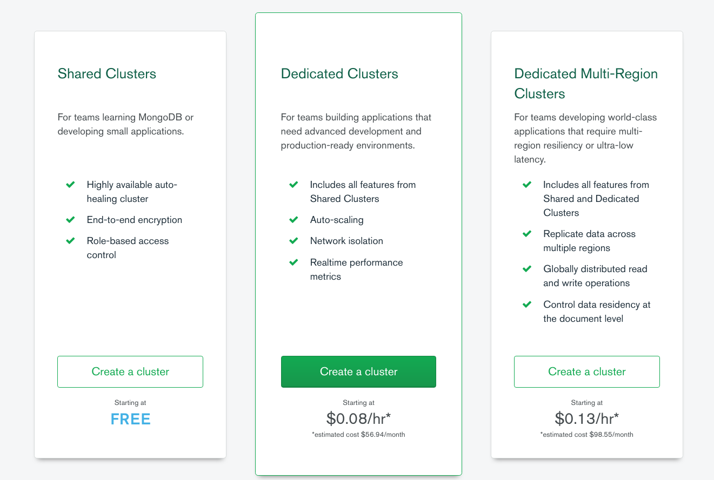
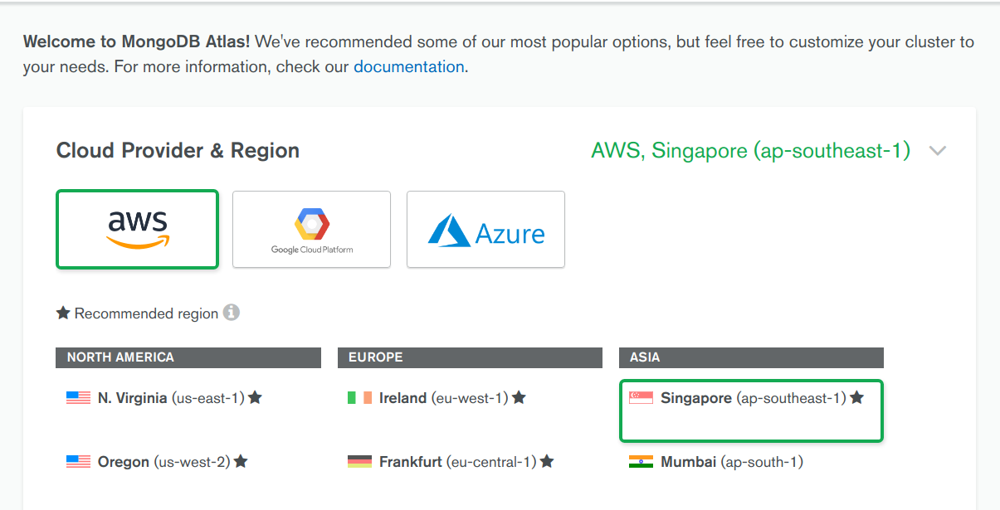
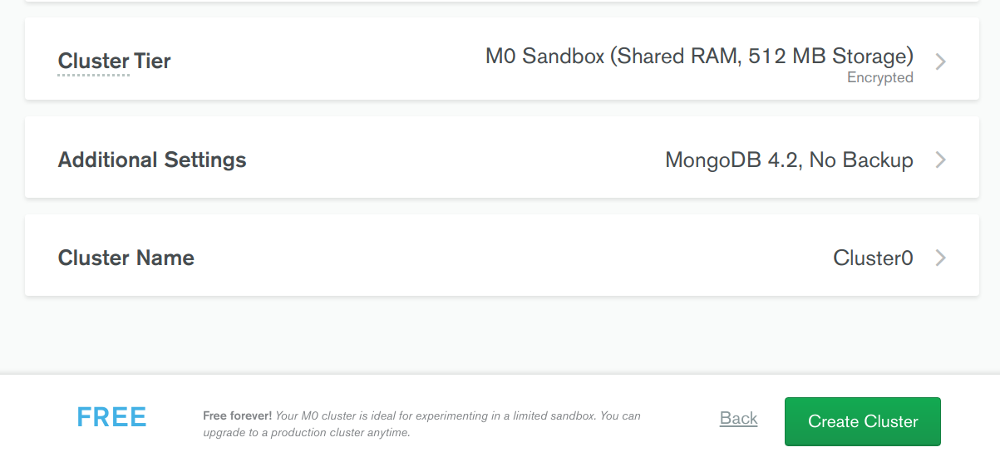
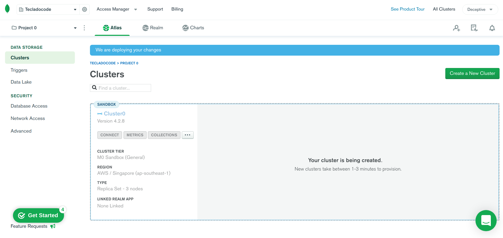
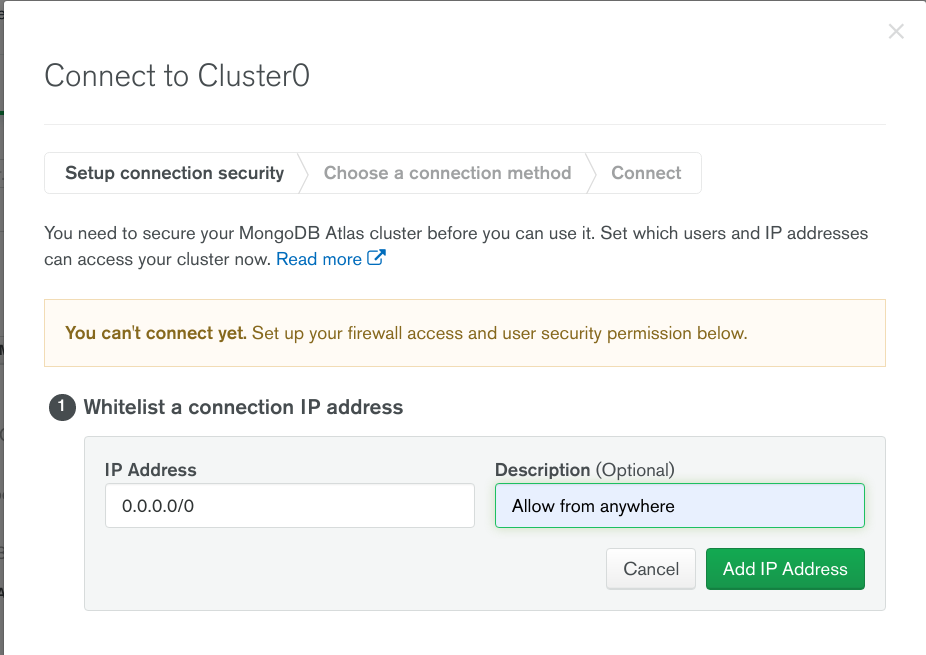
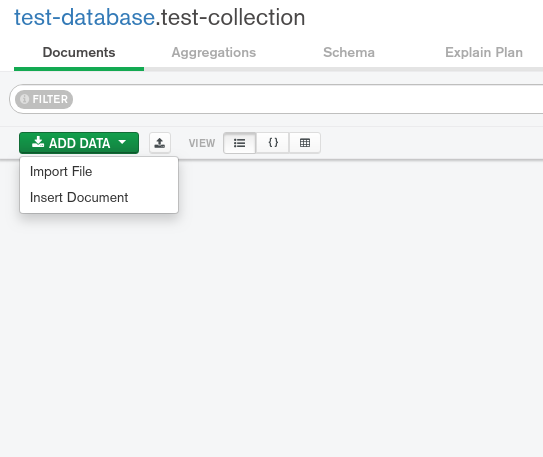
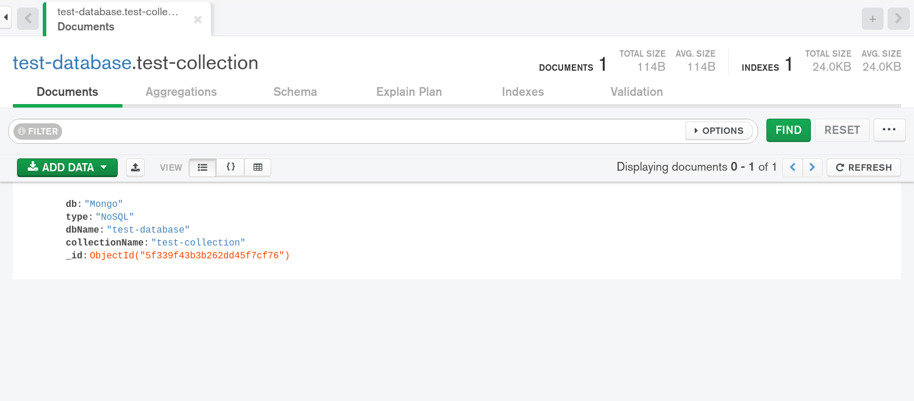

# Accessing MongoDB with Compass & Atlas

Setting up MongoDB and accessing data from it properly can be a bit challenging for beginners. MongoDB Atlas[^atlas] provides an easy way to host and manage data in the cloud without setting anything up locally.

This tutorial guides you through creating an Atlas cluster, connecting to it, and inserting data into it. We'll also use a MongoDB client called Compass to access data from our local machine.

:::tip
A free cluster is a single database that we can access, but there are also paid clusters that can make and manage multiple copies of the database.
:::

## Create an Atlas Account

* Go to the [registration](https://account.mongodb.com/account/register) link. You'll be able to see a page like this:

    

* You'll notice that there are two ways you can complete the signup process - Sign up with a Google account or Sign up via an email. Let's do it using an email. To do so, you'll need to provide the following information:

    * Email Address
    * First Name
    * Last Name
    * Password
    * Company Name
    * Job Function
    * Country

* Review the Terms of Service and the Privacy Policy.
* Click the checkbox to accept the Terms and Policy.
* Click Sign Up to create your account.

    

## Deploy a Free Tier Cluster

* Go to the Atlas login [page](https://account.mongodb.com/account/login), provide your account credentials and sign in to your account.

* You should be able to see the following page where you can start setting up your free MongoDB cluster:

    

* Click the green button that says, **Build a Cluster**. This should take you to the next page where you can select the type of cluster that you want to set up:

    

    In this tutorial, we'll be using the free tier Atlas cluster. Click the button corresponding to the free tier in the leftmost panel.

* Select the host service and region (The default selections should be fine as well):

    

    This page also shows you the specifications of the free cluster:

    

    Click on the button that says, **Create Cluster**.

* Once you've started the cluster creation process, you'll be taken to the following page where you can see the status of the cluster. It can take a while to finish up the process.

    

## Whitelist Your Connection IP Address

An IP address is a unique numeric identifier for a device connected to a network. In Atlas, you can only connect to a cluster from a trusted IP address. Within Atlas you can create a list of trusted IP addresses, referred to as a whitelist, that can connect to your cluster and access your data. Any IP address not present in the whitelist will not be able to connect to your cluster.

* From your *clusters* view, click the **Connect** button for your cluster:

    

* This will bring up the following dialogue box:

    

    You can add your static IP address here. To avoid IP related complications, for now we'll select the third option that says **Allow Access from Anywhere**. This means Atlas will allow you to access the cluster from any IP address.

* When you select **Allow Access from Anywhere**, a prompt asks for IP description. Provide a description and select the *Add IP Address* button:

    

## Create a Database User for Your Cluster

You must create a database user to access your cluster. For security purposes, Atlas requires clients to authenticate as MongoDB database users to access clusters.

* From your Clusters view, click the **Connect** button for your cluster:

    

* Since you've already configured the IP address whitelist, the first option below should show a green checkmark beside it. Now, add your database username and password to the corresponding fields and click on the **Create Database User** button:

    


## Set Up Compass & Connect to Your Cluster

You can connect to your cluster in a variety of ways. This section describes how to connect to your cluster using MongoDB Compass[^compass]. This section also assumes that you've configured an Atlas account with an active cluster, a whitelisted IP address and, a MongoDB user on your cluster.

* From the *cluster* view, select connect:

    

* Since you've already configured your IP and created a database user, you should see the following options to connect to your Mongo database:

    

    Select the third option that says **Connect using MongoDB Compass**.

* When you select the **Connect using MongoDB Compass** button, you'll see another dialogue prompt:

    

* Download and install MongoDB Compass for your operating system.

* Open compass and you'll be prompted to add a *connection string*. Copy the string that appears in the second option above and paste it to the dialogue box:

    

    MongoDB Compass will auto-detect the connection string you copied. To connect, edit and provide your database password in the `<password>` section. When entering your password, make sure that any special characters are URL encoded.

* Once you've completed the authentication procedures, you'll be taken to the database dashboard:

    

    Select the **Create Database** button and provide names for your database and collection in the corresponding prompts:

    

    Now select the **Create Database** button. This will create a database and a collection in your Atlas cluster.

## Insert and View Data in Your Cluster

Select your newly created database from the left panel of the Compass dashboard. In this case, we've created a database named *test-database* and a collection named *test-collection*.

* Select *test-collection* from the left panel and click the **Add Data** button:

    

    Once you've selected the **Add Data** button, it'll ask you how you want to add the data. You can either import the data from a database file or you can add individual documents.

    

    Let's choose **Insert Document** for now.

* Once you've chosen the **Insert Document** button, it'll show another prompt where you can add the document. Let's add the following JSON document to the prompt box:

    ```json
    {
        "db": "Mongo",
        "type": "NoSQL",
        "dbName": "test-database",
        "collectionName": "test-collection"
    }
    ```
    

    Now click insert and you should be able to see your recently added document in the document view panel:

    

## Conclusion

In this lesson, you've learned how to set up a free MongoDB Atlas cluster and connect MongoDB Compass client to the cluster. You've also learned how to create a database, add a collection to the database and finally add documents to the collection.

[^atlas]:[MongoDB Atlas](https://www.mongodb.com/cloud/atlas)
[^compass]:[MongoDB Compass](https://www.mongodb.com/products/compass)
