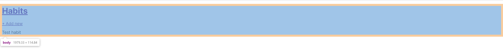
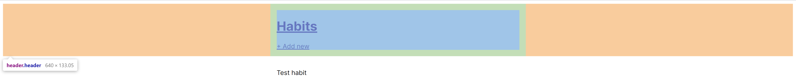
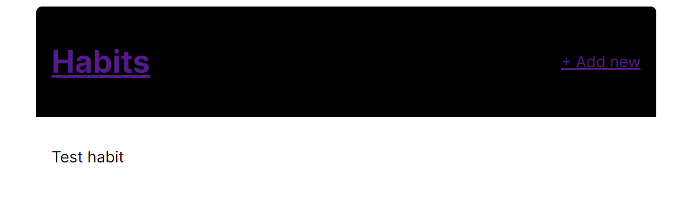
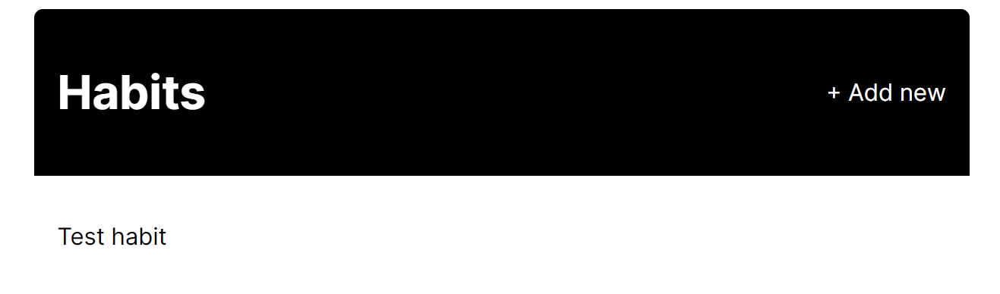
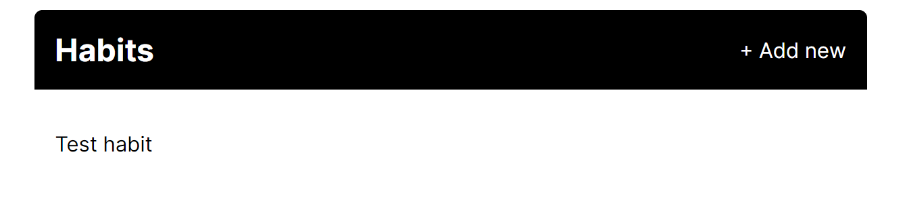
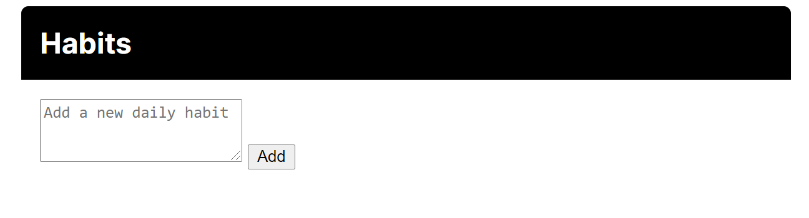
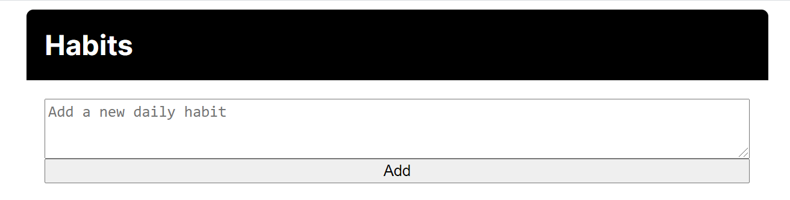
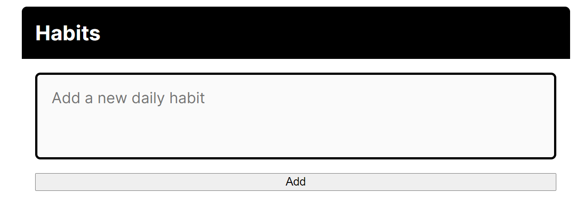
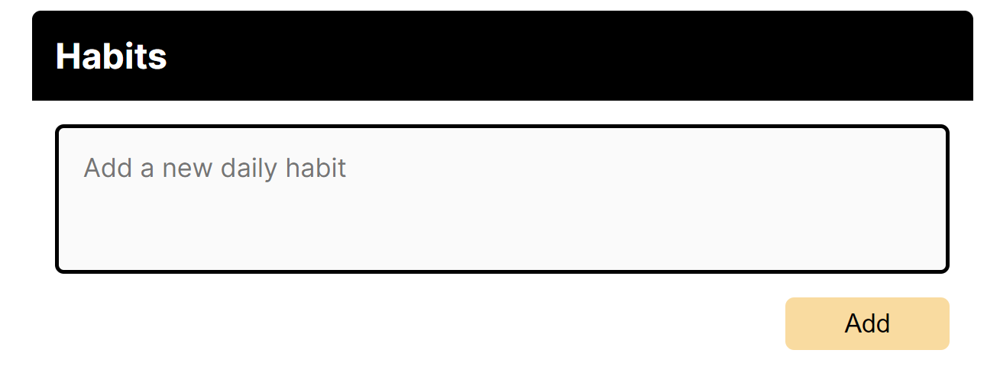

# Styling the habit tracker

[[toc]]

## In this video... (TL;DR)

::: tip
List of all code changes made in this lecture: [https://diff-store.com/diff/cf80936ec06e4a8c984c3bd2f41221e9](https://diff-store.com/diff/cf80936ec06e4a8c984c3bd2f41221e9)
:::

Let's code some CSS! In this video we'll style the header and the add habit form. We won't worry about the habits themselves yet, that's coming later on when we talk about completions.

## Code written in this lecture

Below is the complete diff of `static/css/main.css`. This is the CSS we'll be writing in this lecture.

The code here is for you to copy if needed! Under this code there's a step by step explanation of each CSS fragment and how it affects the look of our app.

```diff
--- static/css/main.css
+++ static/css/main.css
@@ -8,3 +8,67 @@
   box-sizing: border-box;
   font-family: "Inter", sans-serif;
 }
+
+.header {
+  display: flex;
+  background: #000;
+  color: #fff;
+  justify-content: space-between;
+  align-items: center;
+  border-radius: 6px 6px 0px 0px;
+}
+
+.header,
+.main {
+  max-width: 40rem;
+  margin: 0 auto;
+  padding: 1rem;
+}
+
+.header__link {
+  text-decoration: none;
+  color: inherit;
+  transition: color 0.1s ease-in-out;
+}
+
+.header__link:hover {
+  color: #f9dba0;
+}
+
+.header__logo {
+  margin: 0;
+  font-size: 1.5rem;
+}
+
+/* The form class is used for the form where new habits are added. It's not for 
+all form elements */
+.form {
+  display: flex;
+  flex-direction: column;
+  font-size: 1.1rem;
+}
+
+.form__input {
+  width: 100%;
+  padding: 1rem;
+  font-family: inherit;
+  font-size: inherit;
+  resize: none;
+  border: 3px solid #000;
+  border-radius: 6px;
+  background: #fafafa;
+  margin-bottom: 1rem;
+  outline: 0;
+}
+
+.form__button {
+  font-size: inherit;
+  background: #f9dba0;
+  cursor: pointer;
+  border-radius: 6px;
+  padding: 0.5rem 2.5rem;
+  align-self: flex-end;
+  border: none;
+  outline: none;
+}
```

### Centering the app on the screen

To center the app, we need first of all to limit its width. Otherwise, it will take up the whole screen and won't be centerable (is that a word?).

You can see that here:



After limiting its width, we can set the `margin` property to `0 auto`, to remove margins from top and bottom and make them as large as possible (but equal) on the left and right. That'll center the content:

```css
.header,
.main {
  max-width: 40rem;
  margin: 0 auto;
  padding: 1rem;
}
```

This is what that looks like:



### Aligning the header items

We have either one or two header items depending on the page.

If there's one item, we want it to be left-aligned. If there are two items, we want one to be on the left and the other on the right.

We can achieve this with CSS `flex` using the `justify-content: space-between` property. This will separate the elements inside a container by as much as possible, pushing them to the edges.

We'll also make the header black and the text color white. Giving the header a bit of a corner radius at the top-left and top-right makes it look a bit better:

```css
.header {
  display: flex;
  background: #000;
  color: #fff;
  justify-content: space-between;
  align-items: center;
  border-radius: 6px 6px 0px 0px;
}
```

You can see this is a bit better, but still not perfect!



### Coloring the header items

If you look at the app right now, with its current styling, you'll see that the header links are actually the default blue.

That's because links have a color property, so even thought we set the `color` on the `.header` itself, that's not propagating to child links.

We need to set `color: inherit` for them to do that.

At this point I'll also remove the underline which comes with links by default, and the `outline` property. The `outline` is useful for accessibility purposes, but since we're going to have an on-hover effect, it's not needed:

```css
.header__link {
  text-decoration: none;
  color: inherit;
  transition: color 0.1s ease-in-out;
}
```

This looks better already!



Talking about the hover effect, let's add that too.

The `transition` property above will animate any changes to the `color` property. The animation will take `0.1s` and will be eased in and out for a smoother effect.

All we have to do is set a different `color` property when the link is being hovered over, and the `transition` will take effect:

```css
.header__link:hover {
  color: #f9dba0;
}
```

### Setting the header logo size

The header logo is probably a bit too big right now, so let's shrink that a bit and remove the margins that come with `h1` elements:

```css
.header__logo {
  margin: 0;
  font-size: 1.5rem;
}
```

And with this, the header is done!



### Coding the new habit form layout

The new habit form looks pretty barebones at the moment! Let's change that.



We want the button to appear underneath the textarea, so let's do that first. We'll use `flex` together with `flex-direction` to turn the form container into a column. That way, by default, the items will stretch to take the full width of the container and appear one of top of each other.

```css
.form {
  display: flex;
  flex-direction: column;
  font-size: 1.1rem;
}
```



That's better in the sense that we've got the items where we want them, but it doesn't look good.

We still have to style each item individually. Let's begin with the textarea.

We'll do a few things:

- Make sure it is full width with `width: 100%`.
- Set the font size and font family to be the same as the rest of the app, because textareas have a default font set.
- Prevent users from resizing the textarea, which hides the draggable icon at the bottom right.
- Set some padding, border, border-radius, and margin.
- Set a background colour.

```css
.form__input {
  padding: 1rem;
  font-family: inherit;
  font-size: inherit;
  resize: none;
  border: 3px solid #000;
  border-radius: 6px;
  background: #fafafa;
  margin-bottom: 1rem;
}
```

And this is what it looks like:



Finally we've got to get to work on that button!

We want to make sure it isn't full-width. We'll do this with `align-self`, a flex property that allows us to change how one specific element behaves within the context of its parent.

By default, the flex parent will `stretch` its children. With `align-self`, we can choose different behaviour. Here we'll align to `flex-end` which will push the button to the right.

We'll also add some padding within it and change the font size to match the rest of the app.

```css
.form__button {
  font-size: inherit;
  background: #f9dba0;
  cursor: pointer;
  border-radius: 6px;
  padding: 0.5rem 2.5rem;
  align-self: flex-end;
  border: none;
}
```

Now we've got a completed form!

