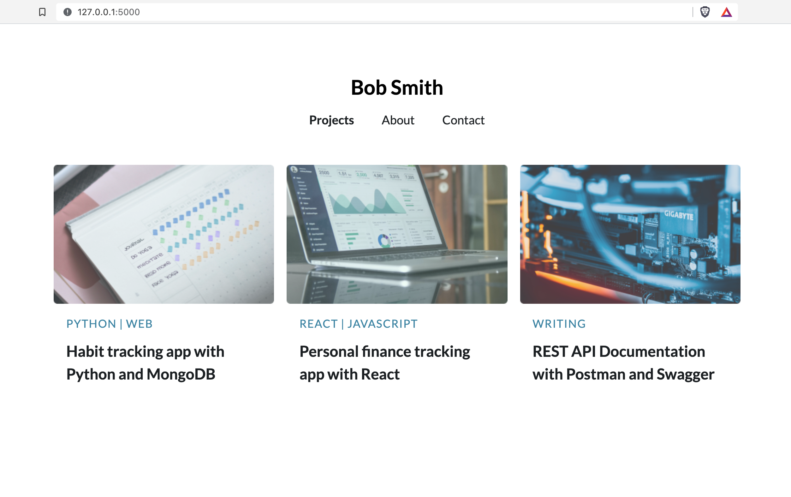
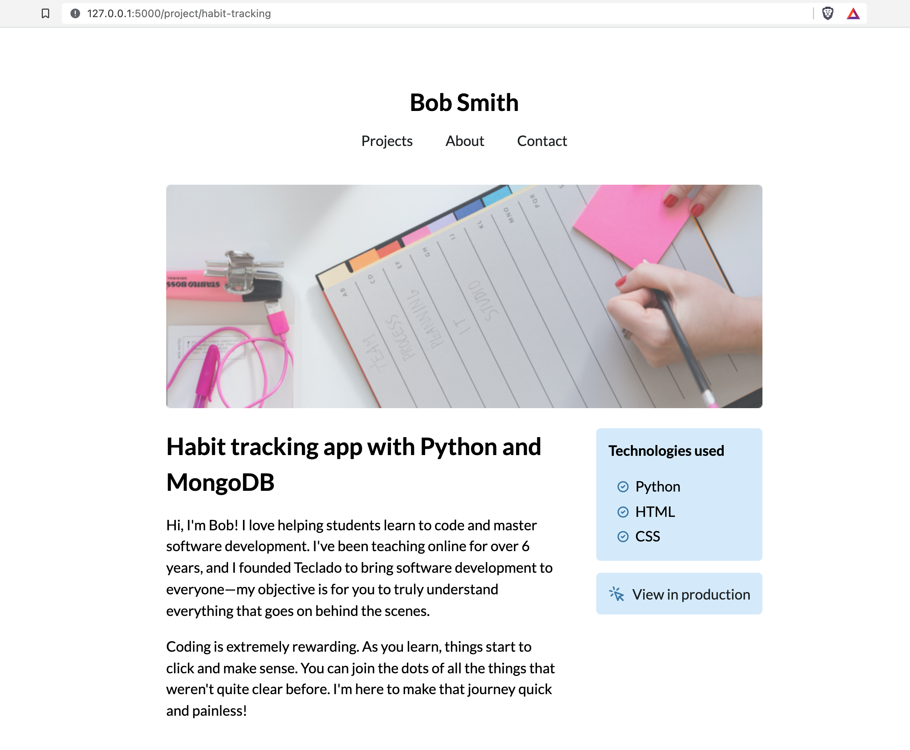
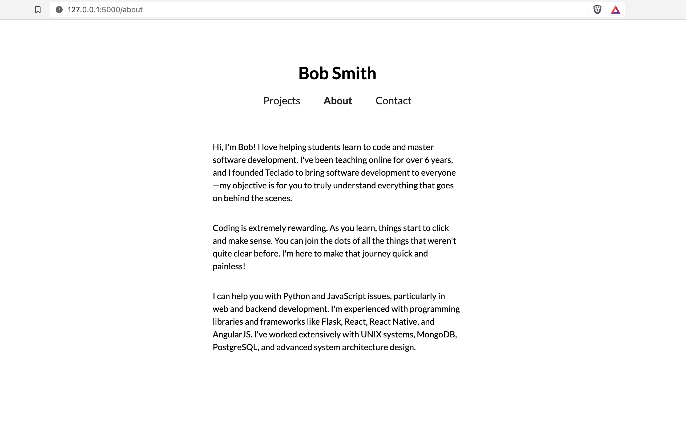
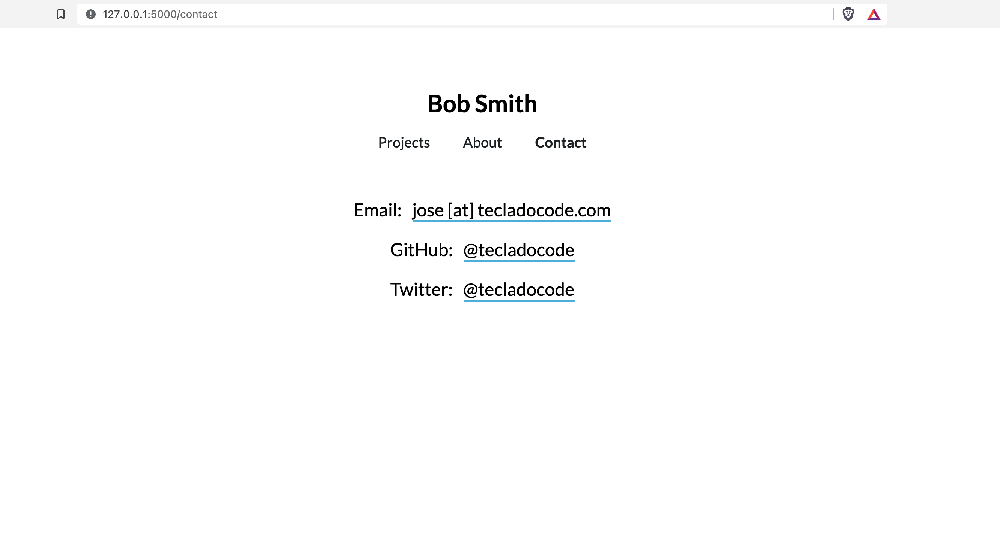

# Portfolio Project Overview

Here's a super-quick overview of what the app looks like and how it works:

The homepage of the app will show the various projects that you've worked on. They are displayed as a grid, and you can always add more projects whenever you want:

Inside any given project, we can write HTML and Jinja code to render our project page. Here you should include information about the project, what you learned from it, who used it, and how you developed it.

This is particularly important when applying for jobs, so make sure you add all relevant details!

Then there are also two more pages: and about page, and a contact page.

The about page will have some information about you, so that the reader can get to know you a bit better:

The contact page can sometimes have a contact form, although that is a bit "old-school" now. Especially for software developers in today's day and age, you should include here your contact details including E-mail, GitHub, and Twitter as those are the most popular forms of communication and work-sharing.

And that's about it! A relatively simple project, but where design and the information you put in is paramount. Plus we'll get to learn about a simple way to make websites by just writing the HTML by hand. We'll also cover CSS animations and error handling with Flask.

Let's get started!