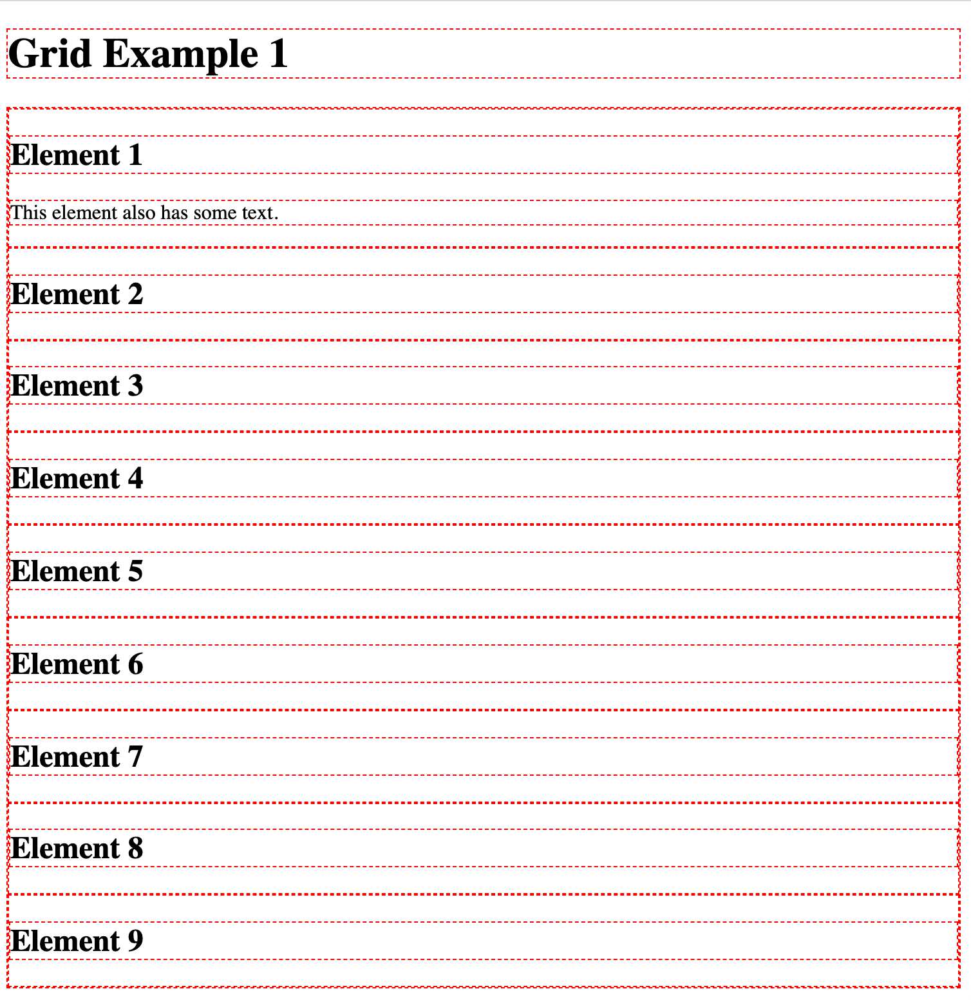
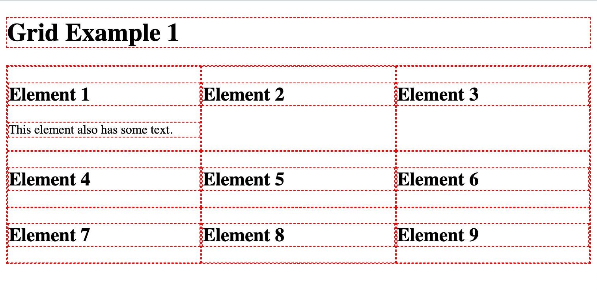
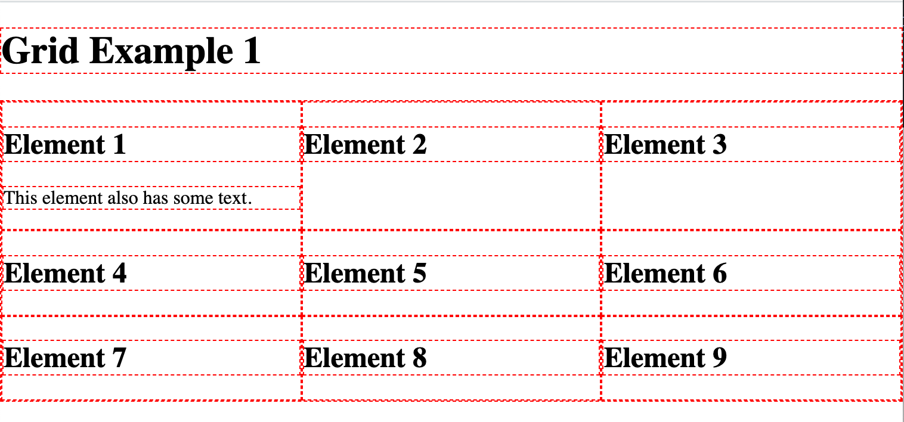
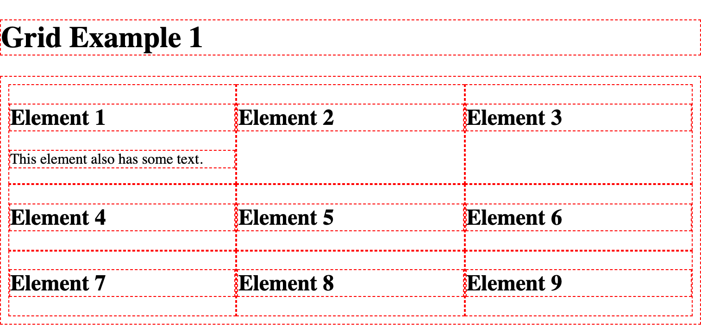
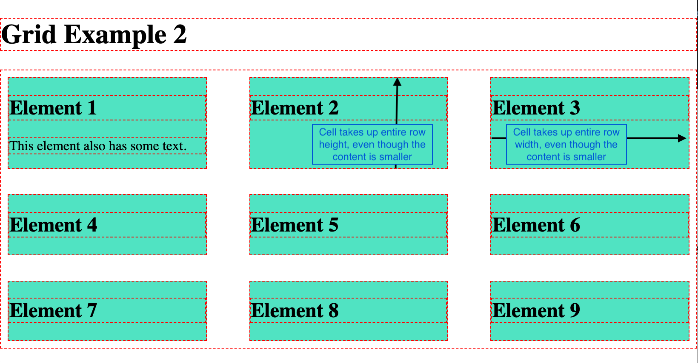
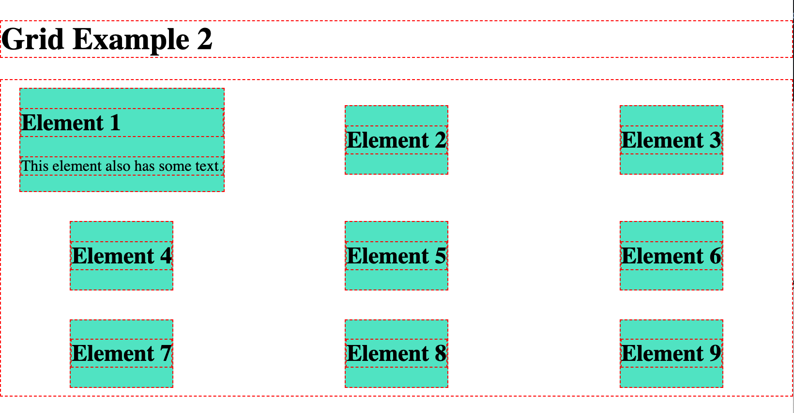
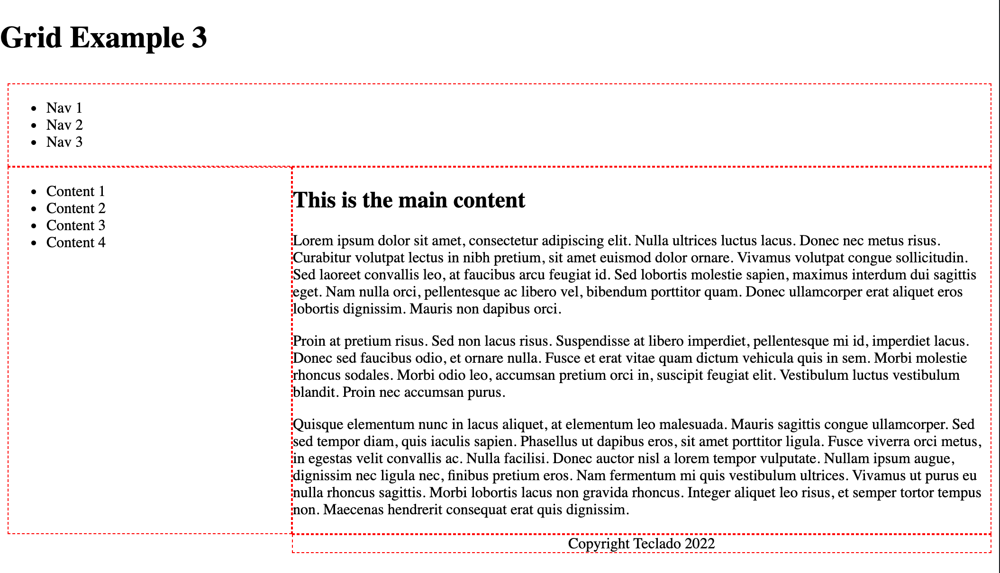
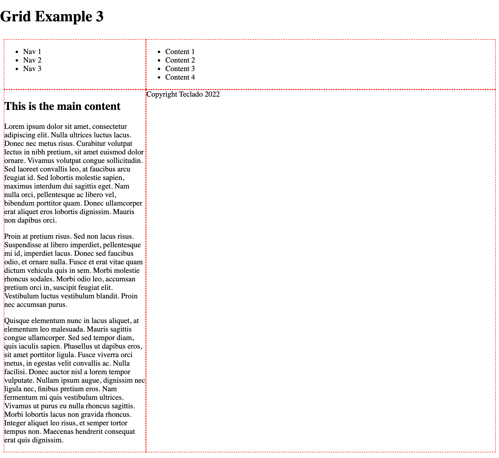

# Introduction to CSS Grid

Let me show you some example of CSS Grid to help you get comfortable with how to use it!

If you want a full, in-depth tutorial on everything that CSS Grid has to offer, I haven't seen a better one than CSS-Tricks' [Complete Guide to Grid](https://css-tricks.com/snippets/css/complete-guide-grid/).

## Example 1: Grid columns and auto layout

For the first and second examples, this is the HTML code:

```html
<body>
  <h1>Grid Example 1</h1>
  <div class="grid">
    <div class="grid__item">
      <h2>Element 1</h2>
      <p>This element also has some text.</p>
    </div>
    <div class="grid__item"><h2>Element 2</h2></div>
    <div class="grid__item"><h2>Element 3</h2></div>
    <div class="grid__item"><h2>Element 4</h2></div>
    <div class="grid__item"><h2>Element 5</h2></div>
    <div class="grid__item"><h2>Element 6</h2></div>
    <div class="grid__item"><h2>Element 7</h2></div>
    <div class="grid__item"><h2>Element 8</h2></div>
    <div class="grid__item"><h2>Element 9</h2></div>
  </div>
</body>
```

We've got a `div` element with the `grid` class, which contains 9 other elements with the `grid__item` class.

We are going to use CSS grid to lay these out as a grid (duh!).

The first thing to do is to set `display: grid` on the container of the items that will belong to that grid. For us, that's the `.grid` element:

```css
.grid {
  display: grid;
}
```

If we load the page like this (remember to link your CSS file in your HTML file), then we get a single-column, single-row grid.

Basically, just a column of items:



So instead, let's tell the `.grid` element that it should have 3 columns:

```css
.grid {
  display: grid;
  grid-template-columns: repeat(3, 1fr);
}
```

Now, refreshing the page will make it look like this:



To make things a bit easier to see, I like using an outline around all elements in our page. Just for debugging and initial development, it's a good technique to see where each element is placed and what it contains.

I will also remove the margin around the `body` element because we usually don't want it anyway:

```css
body {
  margin: 0;
}

body * {
  border: 1px dashed red;
}
```

And that looks like this:



Note that our `.grid` element's outline is superimposed on the `.grid__item` elements. That just makes it a bit more difficult to see what's going on, so let's add some padding and that way the outlines won't be on top of each other:

```css
.grid {
  display: grid;
  grid-template-columns: repeat(3, 1fr);
  padding: 8px;
}
```

And with that, it's pretty clear that we've created a grid with three columns.



It's good that the rows get added automatically as more items get placed inside the grid. We can certainly change which items go into which columns and even rows. Let's look at that in Example 3.

## Example 2: Spacing and alignment

Continuing with the same HTML, let's talk about spacing and alignment.

We can add gaps between rows and columns using `column-gap` and `row-gap`:

```css
.grid {
  display: grid;
  grid-template-columns: repeat(3, 1fr);
  padding: 8px;
  column-gap: 50px;
  row-gap: 30px;
}
```

To make things easier to see, I'll fill in the cell items with a background color:

```css
.grid__item {
  background-color: #50e3c2;
}
```

At the moment each cell in our grid is stretched to take up all the space available to it, both horizontally and vertically.

You can tell this is happening because the smaller elements (those without much content) are the same size as the big first element:



But we can center the content of each cell:

```css
grid {
  display: grid;
  grid-template-columns: repeat(3, 1fr);
  padding: 8px;
  column-gap: 50px;
  row-gap: 30px;
  justify-items: center;
  align-items: center;
}
```

And that can sometimes be interesting. Here it looks a bit weird:



There are a few other settings you can use for these properties. Feel free to check them out!

```css
.grid {
  display: grid;
  grid-template-columns: repeat(3, 1fr);
  padding: 8px;
  column-gap: 50px;
  row-gap: 30px;
  /* justify-items: stretch is the default. center moves them to the center but they no longer stretch! */
  justify-items: start; /* start | end | center | stretch */
  align-items: stretch; /* start | end | center | stretch | baseline */
  /* You can use place-items for both align-items and justify-items */
}
```

## Example 3: Grid areas

Grid areas are one of the most amazing things about CSS grid in my opinion.

They allow us to give a name to one or more cells in our grid, so that we can place content within those defined areas.

So it's easier to understand what I'm talking about, here's what we're going to end up with:



<small>Note: I've removed most of the outlines and only kept outlines for elements within the `.grid` element.</small>

And this is a grid with 2 columns and 3 rows.

- The top row (2 cells) is for the header.
- The middle-left cell is for the sidebar.
- The middle-right cell is for the content (likely, this will be the largest cell by space taken, but that's irrelevant to CSS grid).
- The bottom-left cell is unused.
- The bottom-right cell is for the footer.

Using `grid-template-areas`, we can define such structure like this:

```css
.grid {
  display: grid;
  grid-template-columns: 300px 1fr;
  grid-template-areas:
    "header header"
    "sidebar content"
    ". footer";
  padding: 8px;
}
```

Important:

- `grid-template-columns` defined how big each column is.
- `grid-template-areas` defines the names for certain cells.
  - It doesn't limit the number of rows or cells, as I'll show in a moment.

Let's write the HTML for this. All we have to do is at least have an element for each section of the grid. So we'll need a header, sidebar, content element, and footer.

```html {4,11,19,23}
<body>
  <h1>Grid Example 1</h1>
  <div class="grid">
    <header class="header">
      <ul class="navbar">
        <li class="navbar__item">Nav 1</li>
        <li class="navbar__item">Nav 2</li>
        <li class="navbar__item">Nav 3</li>
      </ul>
    </header>
    <aside class="sidebar">
      <ul class="toc">
        <li class="toc__item">Content 1</li>
        <li class="toc__item">Content 2</li>
        <li class="toc__item">Content 3</li>
        <li class="toc__item">Content 4</li>
      </ul>
    </aside>
    <main class="content">
      <h2>This is the main content</h2>
      <p>Lorem ipsum dolor sit amet, consectetur adipiscing elit. Nulla ultrices luctus lacus. Donec nec metus risus. Curabitur volutpat lectus in nibh pretium, sit amet euismod dolor ornare. Vivamus volutpat congue sollicitudin. Sed laoreet convallis leo, at faucibus arcu feugiat id. Sed lobortis molestie sapien, maximus interdum dui sagittis eget. Nam nulla orci, pellentesque ac libero vel, bibendum porttitor quam. Donec ullamcorper erat aliquet eros lobortis dignissim. Mauris non dapibus orci.</p>
    </main>
    <footer class="footer">
      Copyright Teclado 2022
    </footer>
  </div>
</body>
```

What is actually inside each element is irrelevant to CSS grid.

Now for each element, we need to tell CSS in which grid area they should be placed.

For context, this is what the page looks like before we do so:



Note that, even though our areas are named, each grid item is still placed sequentially in the grid. So the header is on cell 1, the sidebar is on cell 2, the content is on cell 3, and the footer is on cell 4. Cells 5 and 6, though named, are unused.

And this is the CSS  we need to write:

```css
.header {
  grid-area: header;
}

.sidebar {
  grid-area: sidebar;
}

.content {
  grid-area: content;
}

.footer {
  grid-area: footer;
  text-align: center;
}
```

And that's it! It's really that simple. Now it looks like this:


For more information: [https://css-tricks.com/snippets/css/complete-guide-grid/#aa-grid-template-areas](https://css-tricks.com/snippets/css/complete-guide-grid/#aa-grid-template-areas)
