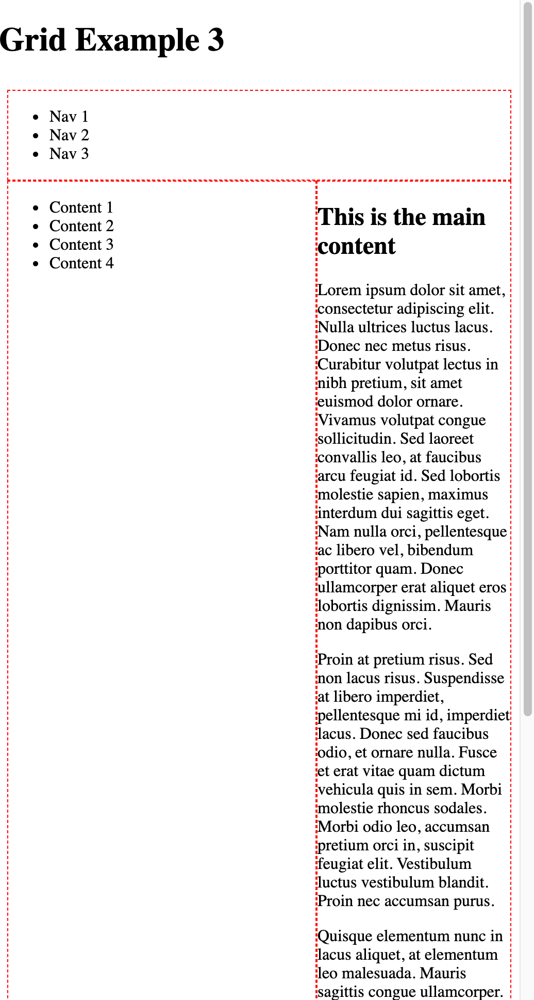
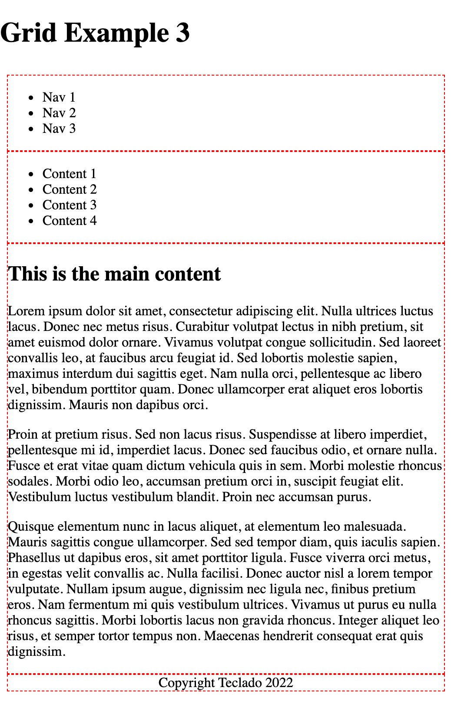

# How do CSS Media Queries work?

CSS Media Queries[^mdn_media_queries] allow us to write some CSS that will only be applied under certain conditions, such as:

- Media features (screen size, orientation, etc)
- Media type (screen, print, etc)

The syntax is a little bit confusing, although there are plans to improve the syntax in the future[^future_media_query_syntax].

For now though, this is how you do it:

```css
.grid {
    display: grid;
    grid-template-columns: 300px 1fr;
    grid-template-areas:
        "header header"
        "sidebar content"
        ". footer";
}
```

That would define a grid as we did in the last example of the previous lecture. It could look like this:


But when the screen gets smaller, you run into problems because the sidebar column is always `300px`:



A frequently used option is to change things so the sidebar is above the content when the screen is very small. Here's how to do that using a media query:

```css
.grid {
    display: grid;
    grid-template-columns: 300px 1fr;
    grid-template-areas:
        "header header"
        "sidebar content"
        ". footer";
}

@media (max-width: 720px) {
  .grid {
    grid-template-columns: 1fr;
    grid-template-areas:
      "header"
      "sidebar"
      "content"
      "footer";
  }
}
```

::: tip
Inside a media query you don't have to change all properties. If untouched, properties remain as defined for the element outside the media query.
:::

You can also define multiple media queries so that as the screen gets smaller, certain properties change.

::: tip
It's also possible to go the other round and have the smallest-screen properties defined globally, and then use media queries as the screen size increases. We'll do this in the next project.
:::

With this CSS change, we get what we wanted:



With media queries, CSS can get a bit bloated--because the same elements are targeted many times, once per media query.

That's why CSS also allows media queries when we define a `link` element to a CSS stylesheet:

```html
<link href="global.css" rel="stylesheet">
<link href="mobile.css" rel="stylesheet" media="screen and (max-width: 600px)">
```

This would let you define a separate `mobile.css` file that is applied _after_ `global.css` and can overwrite the CSS properties applied to any element while the width of the screen is less than 600px.

I don't use this feature often, because I quite like having related CSS selectors and properties together. I find it easier to see all the different changes that could be applied to an element, in a single file.

However if there are a lot of changes being applied, I will consider using this method so the CSS file doesn't get too long and difficult to read.

[^mdn_media_queries]: [Using media queries (MDN Documentation)](https://developer.mozilla.org/en-US/docs/Web/CSS/Media_Queries/Using_media_queries)
[^future_media_query_syntax]: [Syntax improvement for media queries (not well supported yet, MDN Documentation)](https://developer.mozilla.org/en-US/docs/Web/CSS/Media_Queries/Using_media_queries#syntax_improvements_in_level_4)