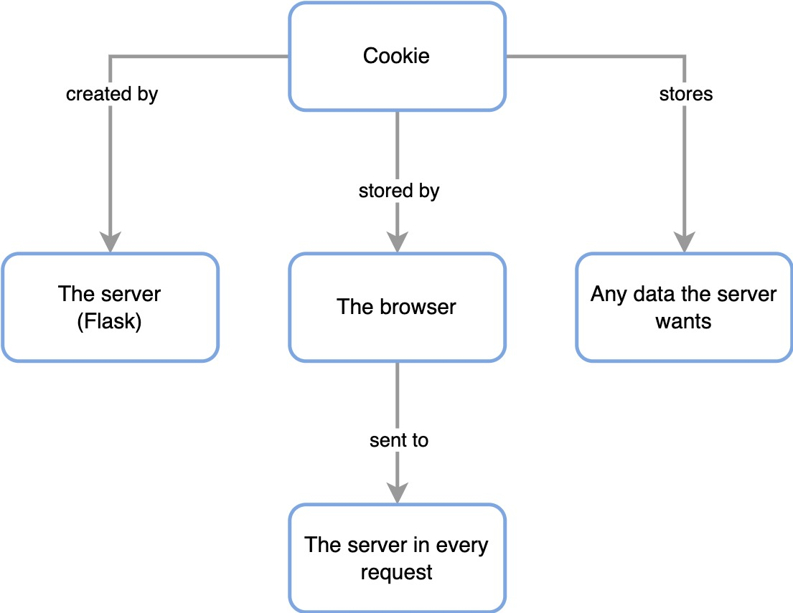
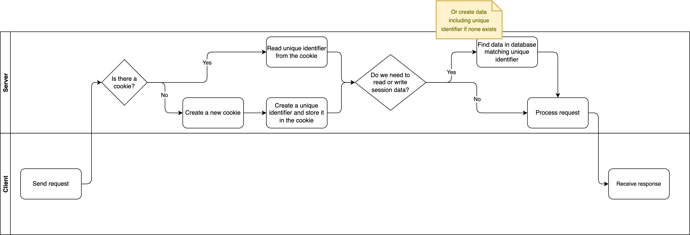

# What are cookies and sessions?

## Cookies

A **cookie** is a piece of data that is:

- Generated by your Flask app (automatically, you don't have to do anything)
- Stored by your web browser
- Sent by the browser to the Flask app in every request the browser makes

But **why**? It seems wasteful for Flask to generate a piece of data and then have the browser send it that same piece of data every request!

The reason: so that Flask doesn't have to remember information about the browser.

If you want your Flask app to "remember" something about a browser, you can put that data in the cookie.

The most obvious example is authentication. When a user (who is on a browser) logs in, you can put in the cookie "logged in".

Because each browser has its own cookie, you can just check every cookie when a browser sends it. If the cookie says "logged in", you know that that browser is logged in.

It's even better if you store _who logged in_ in the cookie. Then when you receive the cookie, you know which user is making the request.

## Session

A **session** is a term for the stored data related to a particular client. In our example above, data stored in the cookie is the "session data".

But session data doesn't have to be stored in cookies. It could be stored in a database, using the cookie solely as an identifier.

Sessions stored in the browser are called "client-side sessions". When stored in a database, they are called "server-side sessions".

Cookies are not 100% safe, so any user can look at the contents of the cookie. That is why we shouldn't store anything in the cookie that we wouldn't want the user to see[^flask_cookie_security].

That's one of the primary reasons for using a database instead.

Here's a quick data flow diagram for server-side sessions (you can enlarge by opening in a new tab):

<BottomCallout></BottomCallout>

[^flask_cookie_security]: [Cookie security for Flask applications (Miguel Grinberg)](https://blog.miguelgrinberg.com/post/cookie-security-for-flask-applications)