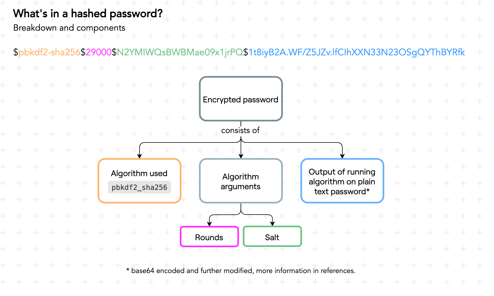

# Password hashing with Flask and passlib

Hashing a password means turning it into a string of letters, numbers, and symbols in such a way that it cannot be turned back into the original text.

There are a few terms that are often conflated:

- Encryption
- Encoding
- Hashing
- Obfuscation

When we do "password encryption", we're really doing "password hashing"[^password_encryption_post]. When we encrypt, we can decrypt. But when we hash, we cannot "un-hash".

So if we can't turn a password hash back into text, how can we check the password is correct when a user tries to log in?

## What's in a hashed password?

For the explanation below I'm using [passlib](https://passlib.readthedocs.io/en/stable/index.html), one of the most popular libraries for password hashing.

When it hashes a password, it saves not only the password hash, but also a few other pieces of data[^hashed_password_format]:

- The **algorithm** that has used to hash the password.
- The **rounds**, or how many times the algorithm ran.
- The **seed**, a string used to randomize parts of the algorithm.
- The **output** of the algorithm itself.

Once you have all those details, checking whether a password the user sends us is valid or not can be done: just re-hash the password and see if it gives the same output as the previously hashed password.



## Hashing password when signing up

To do this, we first need to install `passlib` in our virtual environment:

```
pip install passlib
```

Now, in `app.py`, we can save the hashed password instead of the plain text password:

```diff
+from passlib.hash import pbkdf2_sha256

 @app.route("/signup", methods=["GET", "POST"])
 def signup():
     if request.method == "POST":
         email = request.form.get("email")
         password = request.form.get("password")

-        users[email] = password
+        users[email] = pbkdf2_sha256.hash(password)
         # session["email"] = email
         # - Setting the session here would be okay if you
         # - want users to be logged in immediately after
         # - signing up.
         flash("Successfully signed up.")
         return redirect(url_for("login"))
     return render_template("signup.html")
```

An alternative to importing and using `pbkdf2_sha256` is to use a `CryptContext`[^encryption_passlib_post], but we won't discuss that here.

After doing this code change, your user's saved passwords will look like this: `$pbkdf2-sha256$29000$N2YMIWQsBWBMae09x1jrPQ$1t8iyB2A.WF/Z5JZv.lfCIhXXN33N23OSgQYThBYRfk`.

## Verifying hashed passwords in log in

We can no longer compare the password the user sends us with what's stored in our dictionary.

Instead, we need to use `pbkdf2_sha256.verify`:

```diff
 @app.route("/login", methods=["GET", "POST"])
 def login():
     if request.method == "POST":
         email = request.form.get("email")
         password = request.form.get("password")

-        if users.get(email) == password:
+        if pbkdf2_sha256.verify(password, users.get(email)):
             session["email"] = email
             return redirect(url_for("protected"))
         else:
             abort(401)
     return render_template("login.html")
```

But that's it! That will look at the stored password, and hash the user's password with the same settings. If the new hash and the stored hash match, then the password is correct!

[^hashed_password_format]: [Format & Algorithm (Passlib official documentation)](https://passlib.readthedocs.io/en/stable/lib/passlib.hash.pbkdf2_digest.html#format-algorithm)
[^password_encryption_post]: [Password encryption with Flask and Python (The Teclado Blog)](https://blog.teclado.com/learn-python-password-encryption-with-flask/)
[^encryption_passlib_post]: [Encrypting passwords in Python with passlib (The Teclado Blog)](https://blog.teclado.com/learn-python-encrypting-passwords-python-flask-and-passlib/)